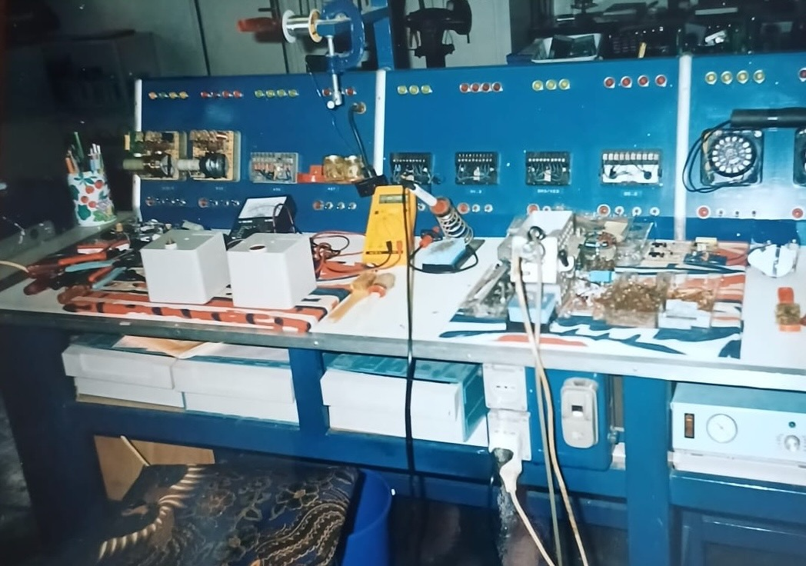
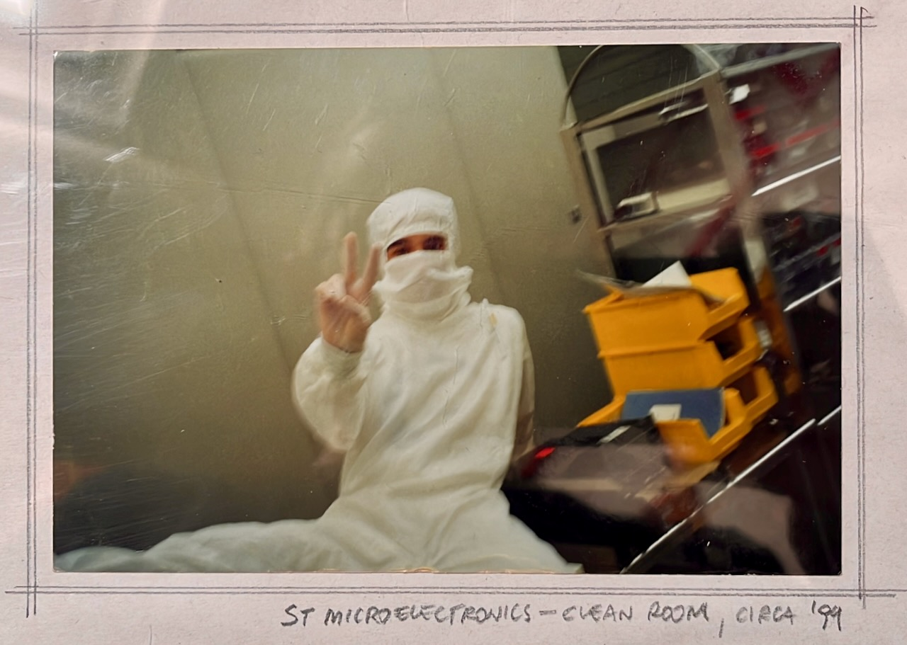
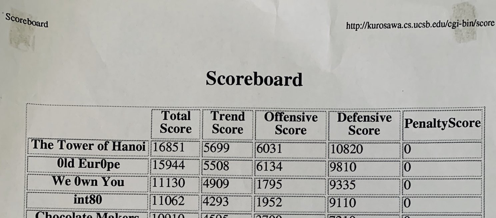
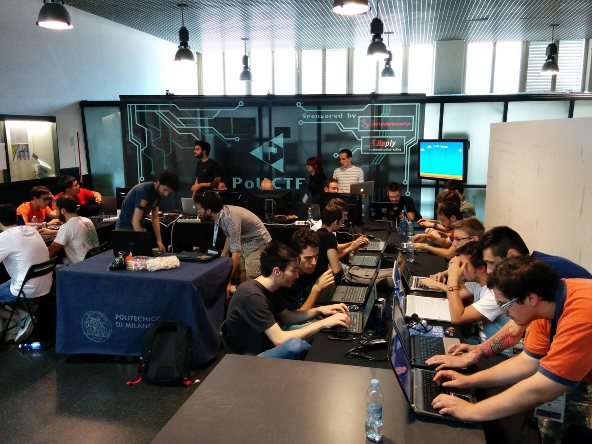
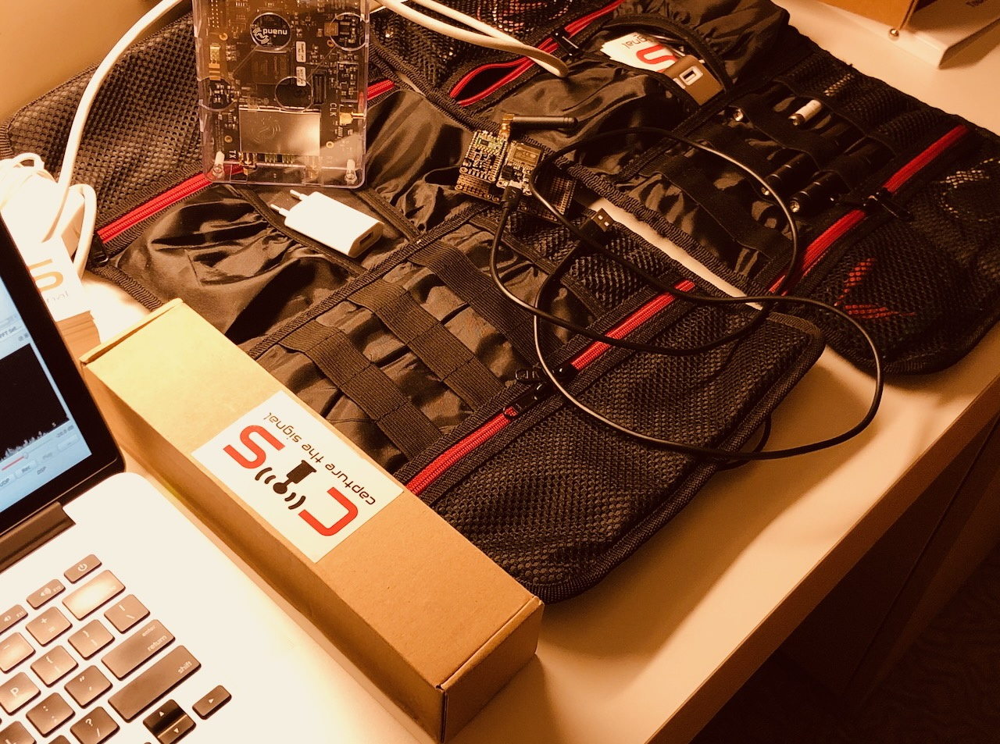
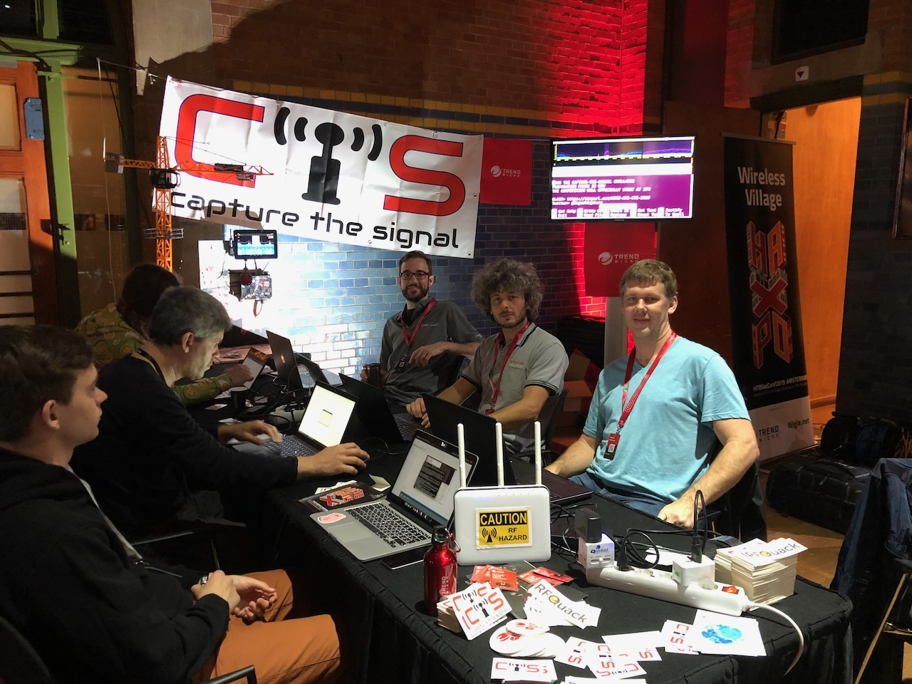
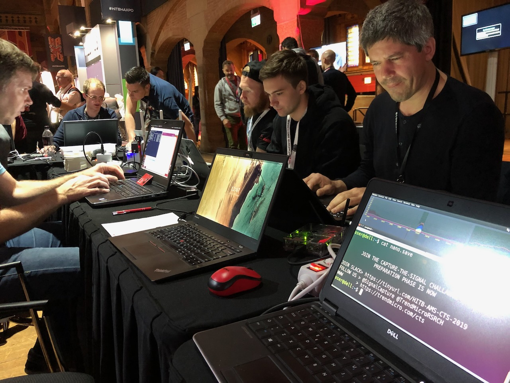
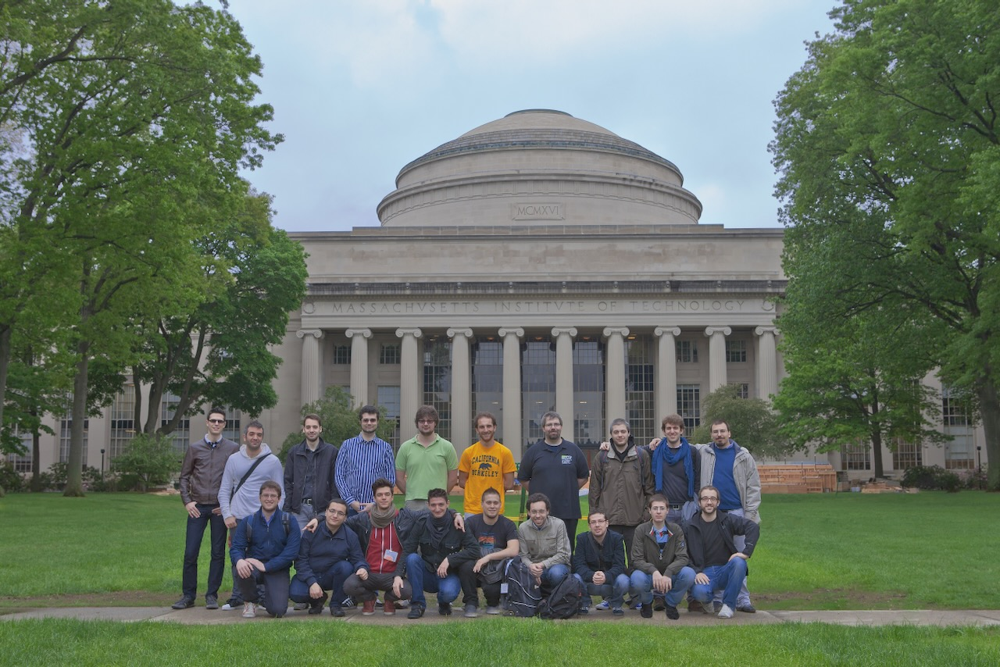

**Trustial** is the name I chose for this space, which is where I gather notes about my past and present work.

In one line, I'm a cybersecurity engineer, researcher, and advisor with broad technical and scientific experience on designing, analyzing, and testing security-critical systems.

I've been in the cybersecurity world since 2004.

Before that, I've started being exposed to electronics while repairing analog HVAC controllers when I was 12, and to silicon manufacturing in summer 1999. The first photo is a garage repair station where I was working, while the second photo is a clean room at ST Microelectronics (Agrate, Milano, Italy).





## What I Do/Did

As part of my job, I reviewed and tested the security of hardware, firmware, and virtualization layers hyperscale AI server platforms, and multi-rack edge-computing infrastructures, supporting millions of customers worldwide. I worked in cybersecurity engineering, research, and development throughout the stack: Intel/AMD/ARM server platforms, peripheral and embedded firmware, web applications, network protocols and devices, embedded protocols and systems for industrial applications, radio frequency control systems, ABB and Kuka industrial robots, cars and mobile devices (Android). I built cloud-native firmware-signing pipelines to enable scalable secure-boot infrastructures, I built firmware-analysis and malware-scanning pipelines, threat-intel systems, helped build mobile ransomware-detection tools, fraud-detection systems, malware behavior mining algorithms, large-scale internet measurements, and anomaly-detection tools.

Some of my work has been featured on mainstream and tech outlets such as [Bloomberg](https://archive.ph/eabjO), [Wired](https://www.wired.com/story/car-hack-shut-down-safety-features/), [Forbes](https://www.forbes.com/sites/thomasbrewster/2019/01/15/exclusive-watch-hackers-take-control-of-giant-construction-cranes/), [Hackread](https://www.hackread.com/watch-as-hackers-take-over-construction-crane/), [ZDNet](https://www.zdnet.com/article/the-coap-protocol-is-the-next-big-thing-for-ddos-attacks/), and [MIT Technology Review](https://www.technologyreview.com/2017/05/04/151992/factory-robot-hacks-electric-medication-and-laws-against-encryptionthe-download-may-3-2017/).

## Hacking and Playing Around With Stuff

I'm not a bug hunter, but I do occasionally [find and report vulnerabilities](/advisories/) as part of my job.

When time permits, I occasionally play CTFs or prepare challenges. Honestly, I haven't been playing for a looong long time: I think 2004 or something, when we (early memebers of the [Tower of Hanoi](http://toh.necst.it/)) played one of the very first editions of the [UCSB iCTF](https://ictf.cs.ucsb.edu/pages/archive.html). Thanks to @[lucacarettoni](https://twitter.com/lucacarettoni) for sharing [this great memory about that game](https://twitter.com/lucacarettoni/status/1078663802302930944). Yes, that's the printout of the scoreboard. Amazing times!



With the same team, in 2015 I have led the organization of the [PoliCTF](http://polictf.it/) contest. Was quite a lot of fun!



I've contributed making the [Capture the Signal (CTS)](https://cts.ninja), a contest focused exclusively on RF-hacking.





## An Academic Moved to the Industry

Before joining Trend Micro, until Summer 2016 I was an Assistant Professor at [Dipartimento di Elettronica, Informazione e Bioingegneria (DEIB)](http://www.deib.polimi.it), [Politecnico di Milano](http://polimi.it) in Italy, where I co-directed the system-security group at the [NECST Laboratory](http://necst.it), and led several projects with my colleague and advisor [Stefano Zanero](http://zanero.org).

The photo below is the best memory I have, when our group visited the MIT in 2013.



During my PhD, I worked mainly on anomaly detection, using machine learning way before it became mainstream. I developed and tested various anomaly-based tools, for example to detect attacks against web applications, by creating models of HTTP requests-responses, or unexpected activities at the kernel level, by creating models system calls of a system under normal activity and detect deviations, which could be sings of malware infections or compromised processes.

## Public Speaking

I have given several lectures and talks, mainly peer-reviewed talks, but also as an invited speaker at international venues and research schools.

I used to hate and be afraid of speaking in public. I still remember my MSc thesis defense presentation, not for the content, but for the feeling: I bombed it! Not technically: I passed. But I walked away with the acute sense that I had completely failed to deliver my ideas. The message was lost. And it felt a quite an embarrassing moment of my humble academic career.

At the time, I didn’t know why. I used to hate and be afraid of speaking in public, and I still remember the tension and anxiety I experienced before every single talk.

Almost a decade later, I started to figure it out.

One turning point was watching a talk by Prof. Herbert Bos: he delivered deeply technical content with such clarity, humor, and control that I learned more about in those 30 minutes than I had in some entire courses. Another was attending a speaker training session by Raimund Genes, then-CTO of Trend Micro, whose approach to message delivery and “entertaining through technical content” changed my view of speaking.

Over the past decade, I’ve seen my own presentation quality improve significantly. I was (and still I am) far from being a professional speaker, but people say I’m good at speaking. Have a look at some of [my public speeches to get a sense of my speaking style](https://www.youtube.com/playlist?list=PL8hbvIylvVeiC3CeGDQ1NJXEI9fCZKN0x).



<br />



## From Public Speaking to Speaker Coaching

I started noticing that some presentations just stuck better, not because they were more advanced, but because they were intentionally designed. But I couldn’t yet fully grasp how.

That moment came in 2021, when I discovered [Amazon’s working-backward approach](https://workingbackwards.com/), the idea that great outcomes are engineered by starting with the end clearly in mind. The best presentations weren’t just well delivered and well rehearsed—they were strategically and intentionally planned, starting from the last slide.

Ironically, as my speaking quality improved, my opportunities to present began to shrink: fewer talks, fewer slides, fewer stages, more day-to-day work priorities.

But then something fortunate happened: I was offered to volunteer as part of the [Black Hat Speaker Coaching Program](https://www.blackhat.com/html/speaker-coaches.html).

This opportunity kept the momentum going, and gave me the chance to work directly with incredible technical talents from around the world: first-time speakers and seasoned researchers alike, all with important stories to tell, and raw material worth polishing. Helping them shape their talks and make their message shine has been one of the most rewarding experiences of my career.

In cybersecurity, brilliant research and groundbreaking findings risk vanishingl into the noise: not because they’re unimportant, but because they’re poorly communicated. If I can help you, please [get in touch](/contacts).

Read [more about speaking](/blog/cybersecurity-supercommunicators/).

## Review Board Work

I'm regularly invited to serve in the review board, organizing or technical program committee of conferences. To name a few besides Black Hat US and EU, I have been the PC (co)chair of [DIMVA 2023](https://www.dimva.org/dimva2023/) and [DIMVA 2024](https://www.dimva.org/dimva2024/), general chair of [DIMVA 2015](https://www.dimva.org/dimva2015/), PC chair of [EUC 2014](http://euc14.necst.it/) and PC member of several conferences and workshops including [ACSAC](https://www.acsac.org/), [AsiaCCS](https://dl.acm.org/event.cfm?id=RE289), [DIMVA](https://dimva.org/), [SecureComm](http://securecomm.org/).

## Formal Bio, Headshot, etc.

### Short Bio

```markdown
With more than a decade of research experience in the cybersecurity field,
Federico Maggi has worked on AI platform security, offensive and defensive
projects in web applications, network protocols, embedded systems,
radio-frequency control systems, industrial robots, cars, and mobile devices.

Federico's work has been featured on mainstream and tech outlets such as
Bloomberg, Wired, Reuters, Forbes, Hackread, ZDNet, and MIT Technology
Review.

Currently employed as a Security Engineering Manager at AWS with focus on
server firmware and hardware, Federico has been a Research Expert in the Huawei
AI4Sec Research team, and a Senior Researcher with Trend Micro. Previously,
Federico was an Assistant Professor at Politecnico di Milano, one of the leading
engineering technical universities in Italy. Aside his teaching activities,
Federico co-directed the security group and has managed hundreds of graduate
students.

Federico has given several lectures and talks as an invited speaker at
international venues and research schools, and also serves in the review or
organizing committees of well-known academic and industry conferences.

More info about Federico and his work is available online at https://maggi.cc
```

### One-liner Bio

```markdown
Federico Maggi is a cybersecurity engineer, researcher, and advisor with broad
technical and scientific experience on designing, analyzing, and testing
security-critical systems.
```

Alternate version:

```markdown
Federico Maggi, PhD, is a Security Engineering Manager with AWS, and has been
working in cybersecurity for more than a decade with the public and private
sector.
```

### Head shot

<a href="headshot.jpg"></a>

You can also grab the <a href="headshot-hires.jpg">high-resolution version</a>.
