After having analyzed the several RF protocols for industrial applications,
distributed by global vendors, we discovered that none of them had
sufficient security features to prevent an attacker from hijacking the
communication and manoeuvre the controlled connected machines.

<!--more-->

In Summer 2016 the condo we live in went through some renovation work. We had
construction workers here for the about half a year. This was around the time
when I was getting into software-defined radio (SDR) technology, and had
a spectrum analyzer open all the time on my computer. Just for fun. After
a while I've noticed some peaks of energy around 434MHz. I didn't pay
attention, until when I saw one of the workers holding what looked like
a rugged remote controller with a tiny antenna.

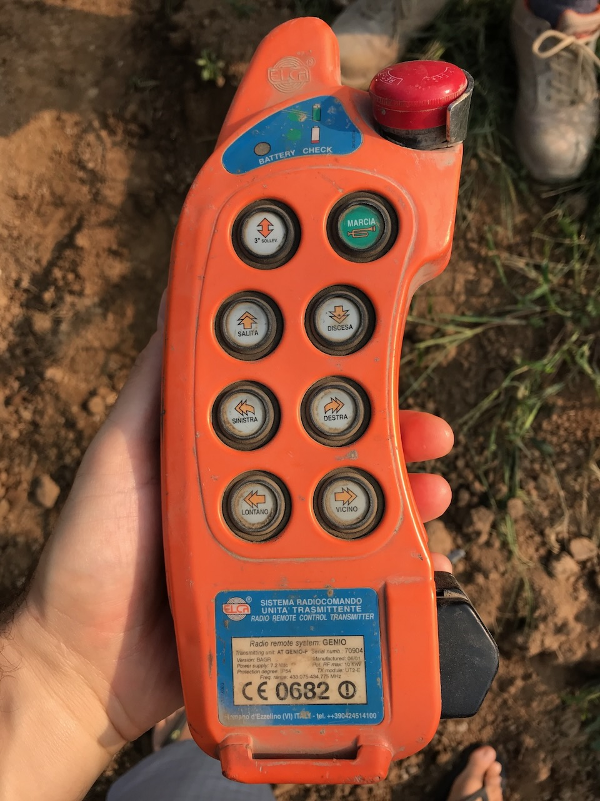

I rushed back in my office and took a closer look at the spectrum: I could clearly see that the peaks were showing in perfect sync with the noise of the huge crane swinging over my roof.

I had a little chat with the worker and asked him: "Is there any safety
mechanism? Like, if I push a button to make the load go down, and someone is
under that load, what happens?" In the local dialect, he answered something
that I could roughly translate as: "_🤬 if you do that, you must have some serious problems._"

This sounded like the perfect project idea to pitch to my colleagues! So I did.
After some back and forth, brainstorming, and someone in the team having
related ideas, we've decided to go after this, map the market, reverse engineer
the protocols, look in depth into the embedded systems inside these remotes,
and perform an all-around security analysis.

Read the reports below if you're interested in the details. For now, I'm going
to post a few pictures.

First, we visited a few sites: here's a picture of a Telecrane remote.

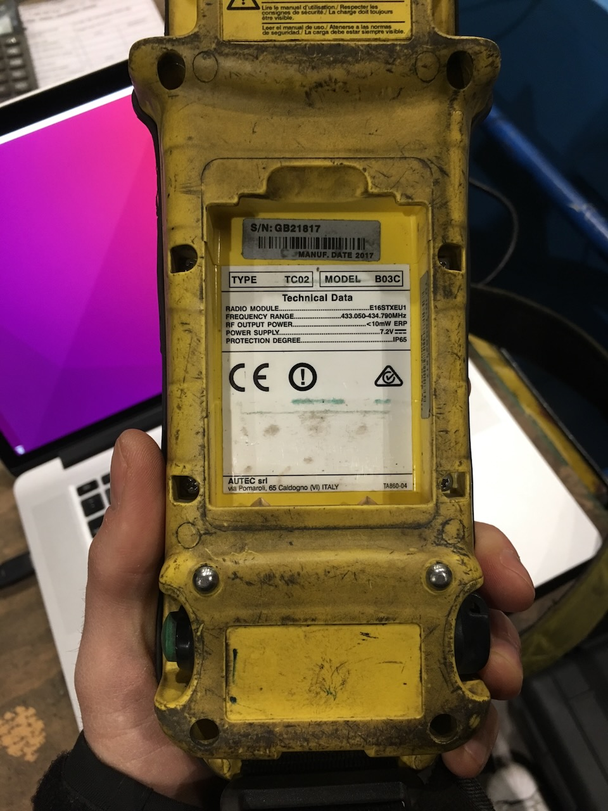

Then we bought a unit, which ended up being a white label made by Taiwanese brand Juuko, and focused on that.

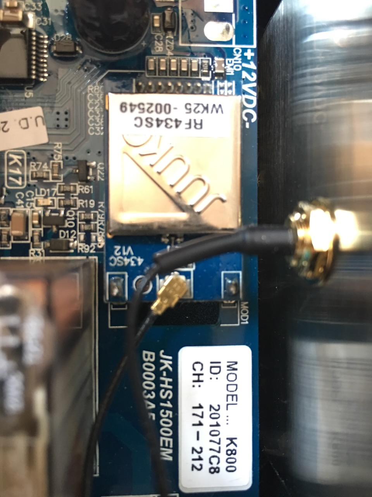
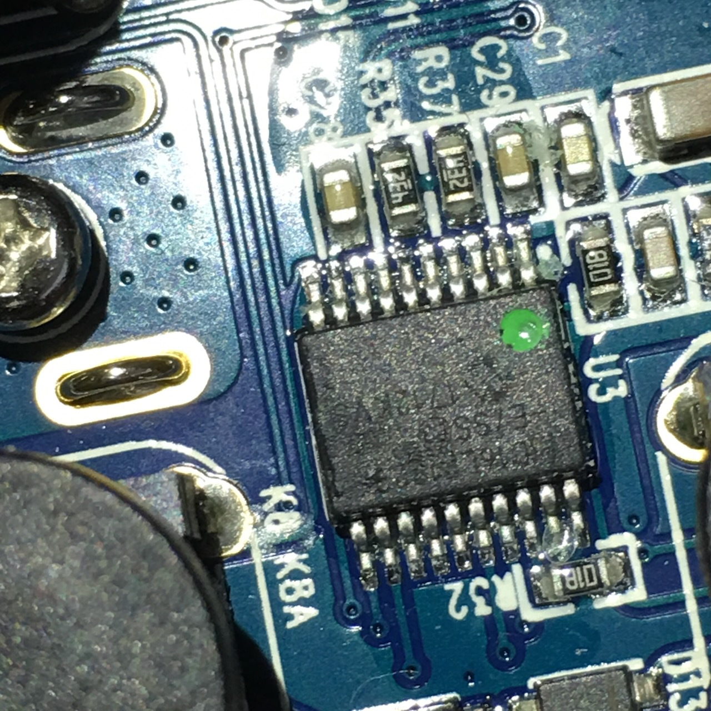
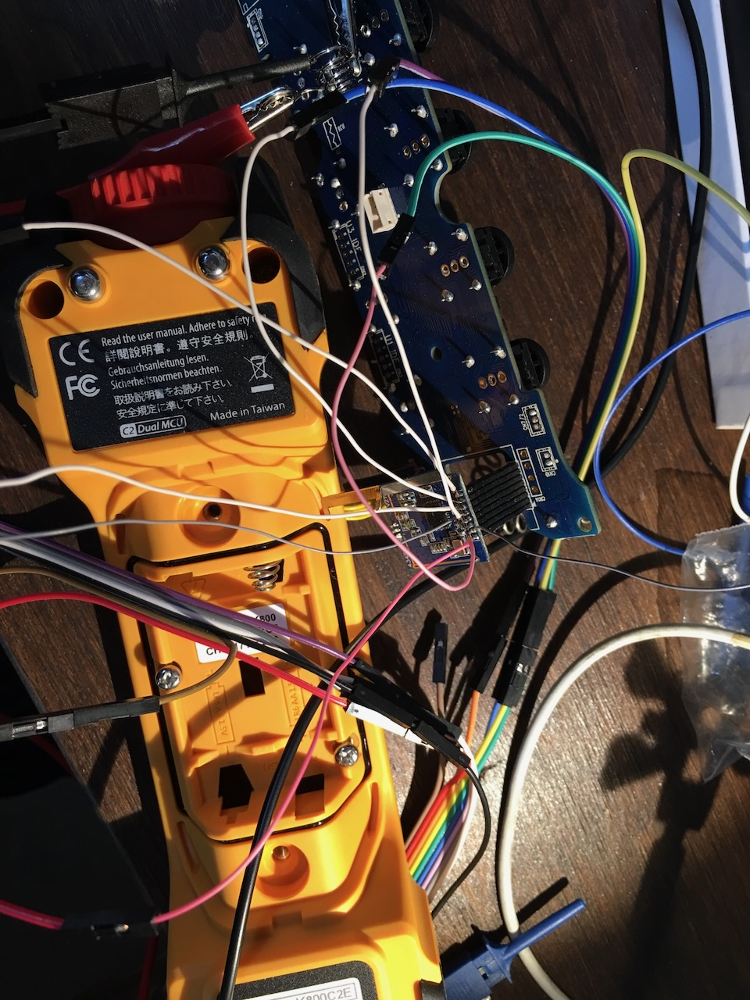
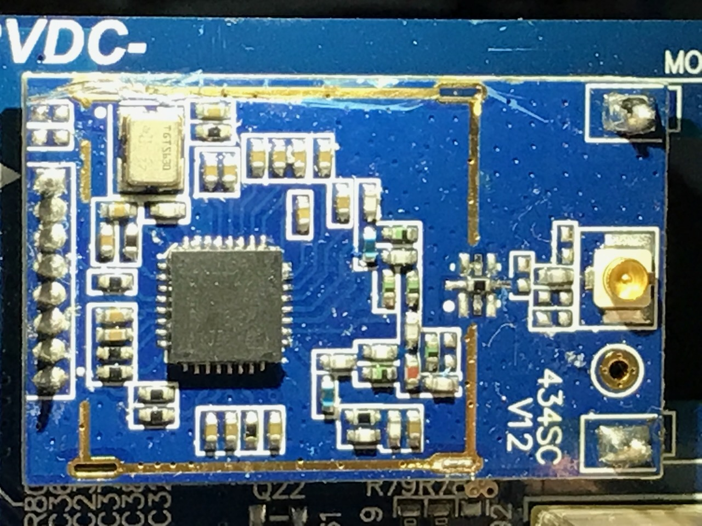

Once we identified the frequency bands, we did some war driving nearby construction and industrial sites to confirm these units are actually in use.

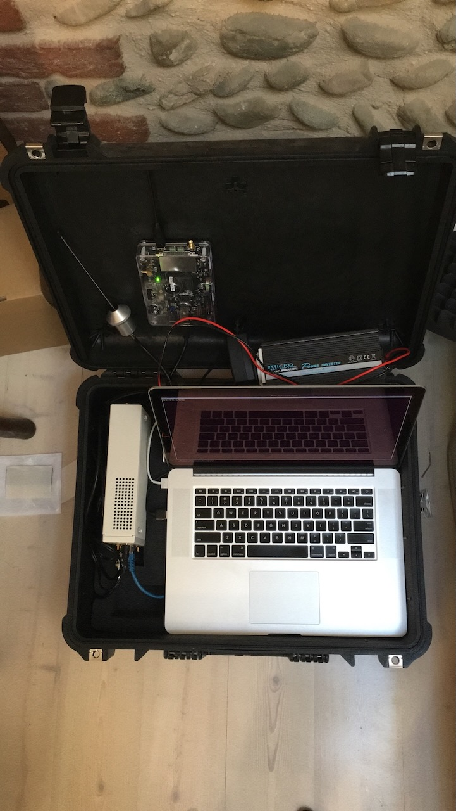
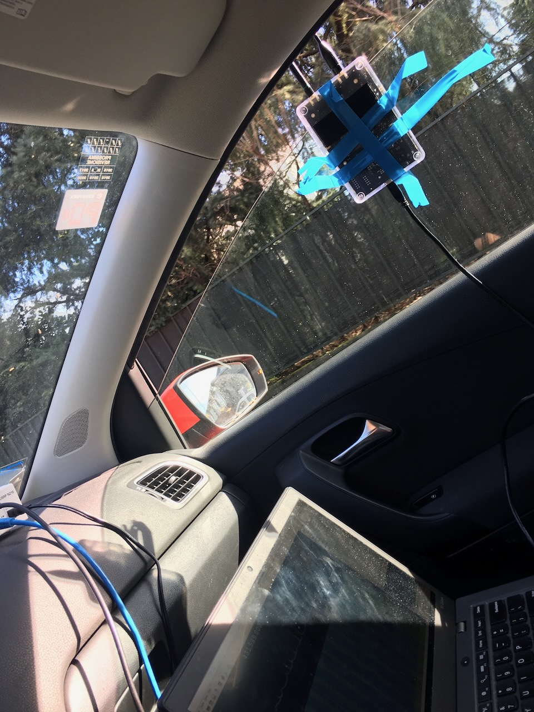

Before wrapping up, I created a dongle to show the feasibility of a remote attack (just hide it nearby the target site and remote into it via cellular).

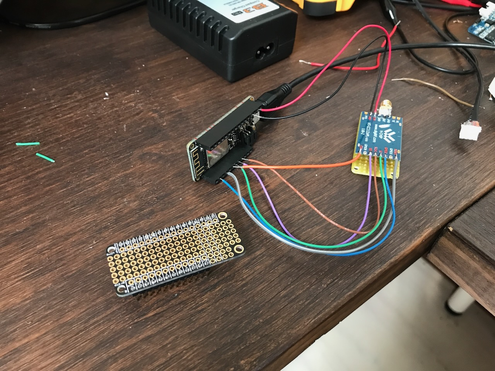
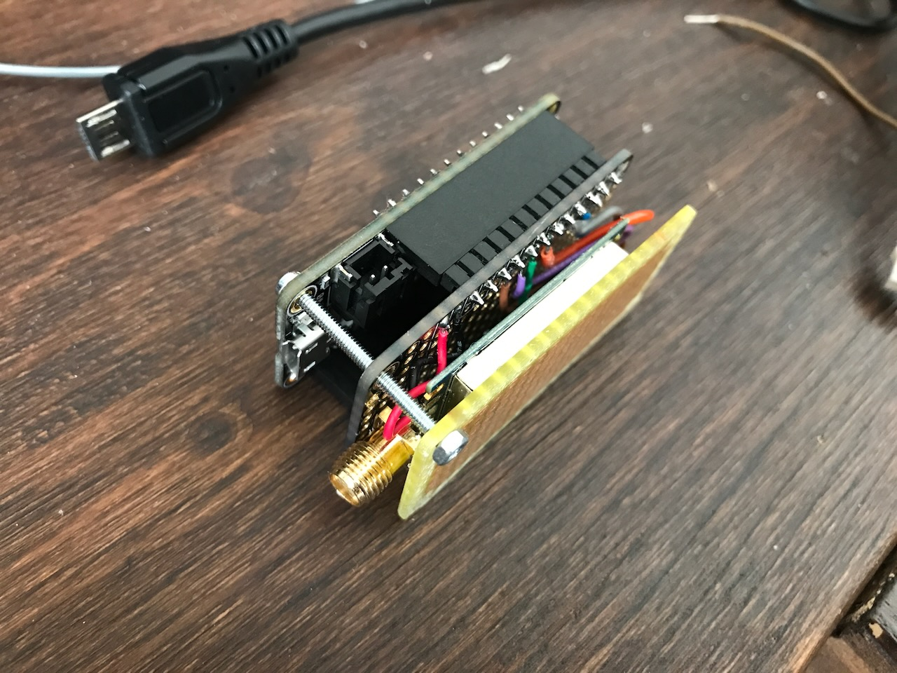

A few months later, with the help of a student, I made RFQuack, a fully modular hardware-firmware system to hack packet radios.

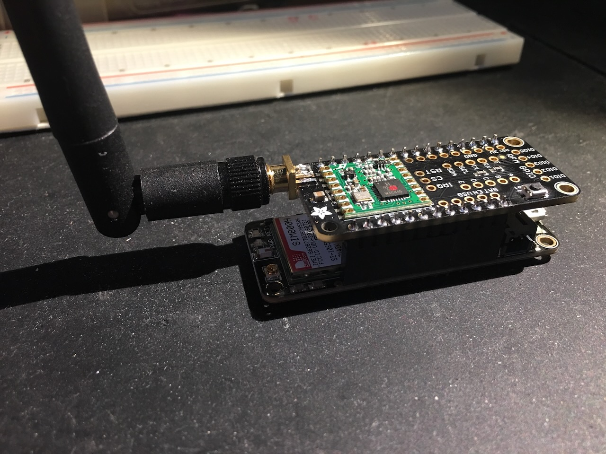
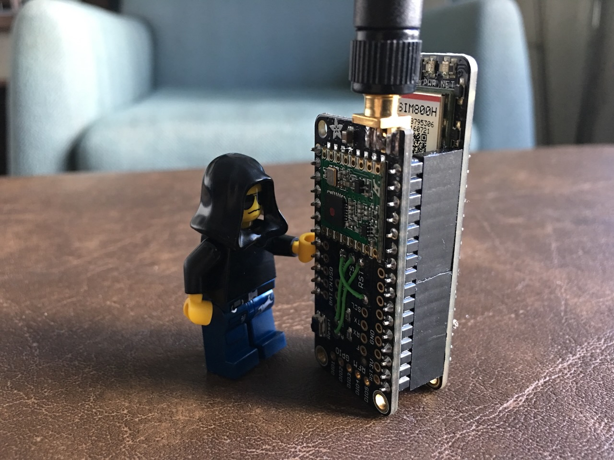

So here we are. After a long break in the middle, hard research work, and
a challenging disclosure process, I'm very happy to share the results of what
my colleagues in Trend Micro Research and I have produced.

Meanwhile, the renovation work is done and we're enjoying a shiny new stone
paver.

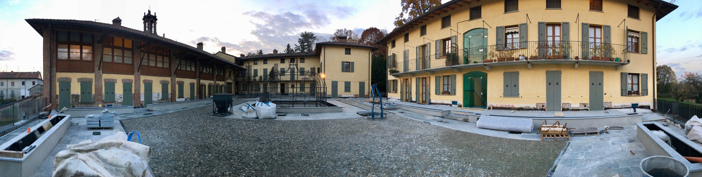

## Radio-frequency Technology

Sub-gigaherz radio-frequency (RF) protocols are widely adopted for both
consumer and **industrial applications**. From simple garage-door openers to
remote controllers that manoeuvre huge mining drillers or overhead cranes that
can lift tons of loads. So, way beyond construction cranes. These RF protocols
operate in the ISM bands (e.g., 433, 868, 915 MHz, depending on the region),
have a **range up to several hundreds meters**, can easily go through
obstacles, are very low priced, and are very flexible.

## Industrial RF Remote Control Systems

These industrial remote-control systems usually comprise a receiver (RX) with
a few relay switches (e.g., to power up the controlled motor or other
electrical loads), and a transmitter (TX) that looks like a rugged remote
controller with buttons. Both RX and TX have an **embedded digital radio chip**
and a micro-controller that implements the actual application-level protocol
(e.g., structure of messages, CRCs, pairing, addressing). Each transmitted
message carries a distinct **command** that the RX actuates, usually by
triggering the relay switches in a given, configurable way.

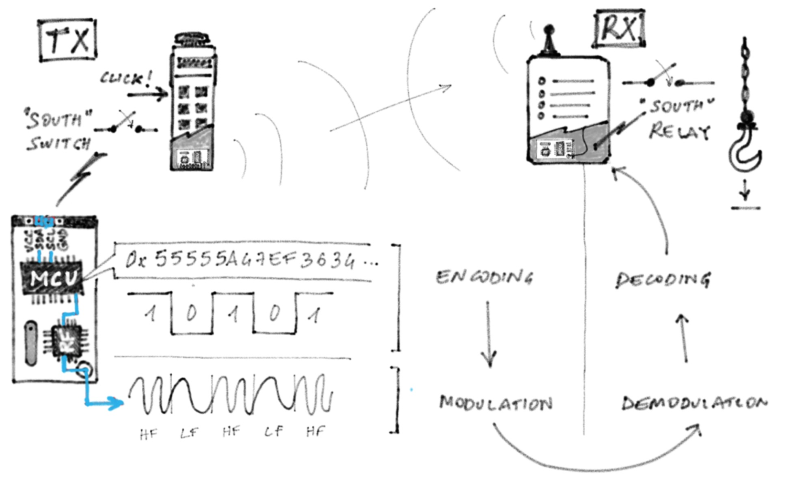

## Security Angle

Despite the simplicity of these systems, **there is no standardization** in the
application-level protocol, nor security best practices that go beyond the use
of rolling-code to avoid replay attacks (in the best case).

After having analyzed the systems produced by several global vendors, in our
research we discovered that none of the implementations had any robust security
features (not even rolling codes) that would prevent an attacker from hijacking
the communication and take control of the heavy industrial machines connected
to the RX unit. After having responsibly disclosed our findings through [Trend
Micro's ZDI](https://www.zerodayinitiative.com/) ([10 advisories and 3 ICS-CERT
alerts](/advisories/), some of which resulted in security firmware updates), we've drawn
a list of recommendations for end users, system integrators, and vendors, to
ensure that current-generation systems get properly secured, and that
next-generation systems will be secure by design.

## Details? Nope!

This has been the hard part. Digging into custom protocols and figuring out
all the bits that travel on the SPI bus (to make sure that we're looking
at the right data on the RX side) was challenging, yet a lot, lot of fun!

No, this blog post won't go into the details. There's the white paper (below)
for that! Plus [this interactive page with demo videos](https://www.trendmicro.com/vinfo/us/security/news/vulnerabilities-and-exploits/attacks-against-industrial-machines-via-vulnerable-radio-remote-controllers-security-analysis-and-recommendations), and [this blog post that describes a little RF dongle we've built for this research](https://blog.trendmicro.com/trendlabs-security-intelligence/demonstrating-command-injection-and-e-stop-abuse-against-industrial-radio-remote-controllers/).

I've presented this research at [Direction Tokyo last
November](https://direction.trendmicro.com/sess/) (by the way, my first
encounter with the Japanese culture was stellar!), my colleague
[Philippe](https://twitter.com/miaoski) has presented [it at HITCON
pacific](https://hitcon.org/2018/pacific/downloads/1213-R1/1610-1650.pdf)
focusing on the firmware reverse-engineering, and my colleagues
[Jonathan](https://www.linkedin.com/in/jonathan-andersson-b516b9/)
([this](https://www.engadget.com/2016/10/28/icarus-hijack-dmsx-drones/)
Jonathan) and [Stephen](https://twitter.com/sjhilt) have just presented the
white paper today at [the S4
conference](https://s4xevents.com/sessions/the-industrial-radio-project/).

## Media

I'm not attempting to keep track of the media activity around this research, sorry!

- [あなたの機械、安易につなげて大丈夫？　リスクと攻撃手法を知る](http://monoist.atmarkit.co.jp/mn/articles/1811/19/news054.html), Nov 19th, 2018
- [クレーンを不正に遠隔操作、10年前より「攻撃しやすい」？　専門家が注意喚起](http://www.itmedia.co.jp/news/articles/1811/29/news027.html), Nov 29th, 2018
- Scott Shuey, Gulf News, [The next cyber threat won’t be over the internet, it’s on the radio](https://gulfnews.com/technology/the-next-cyber-threat-wont-be-over-the-internet-its-on-the-radio-1.61093289) ([print version](http://gulfnews.newspaperdirect.com/epaper/viewer.aspx?issue=11252019010400000000001001&page=18&article=47eb5960-bdd2-487e-a806-eca02e63fc0e&key=KkfY%2BCKWAUSFjN6c%2Fj%2Bzmg%3D%3D&feed=rss)). Jan 5th, 2019
- Thomas Brewster, Forbes, [Watch Hackers Take Control Of Giant Construction Cranes](https://www.forbes.com/sites/thomasbrewster/2019/01/15/exclusive-watch-hackers-take-control-of-giant-construction-cranes/). Jan 15th, 2019
- Sean Lyngaas, CyberScoop, [Look to the sky: How hackers could control cranes by abusing radio frequencies](https://www.cyberscoop.com/crane-hack-radio-frequency-trend-micro-s4x19/), Jan 15th, 2019
