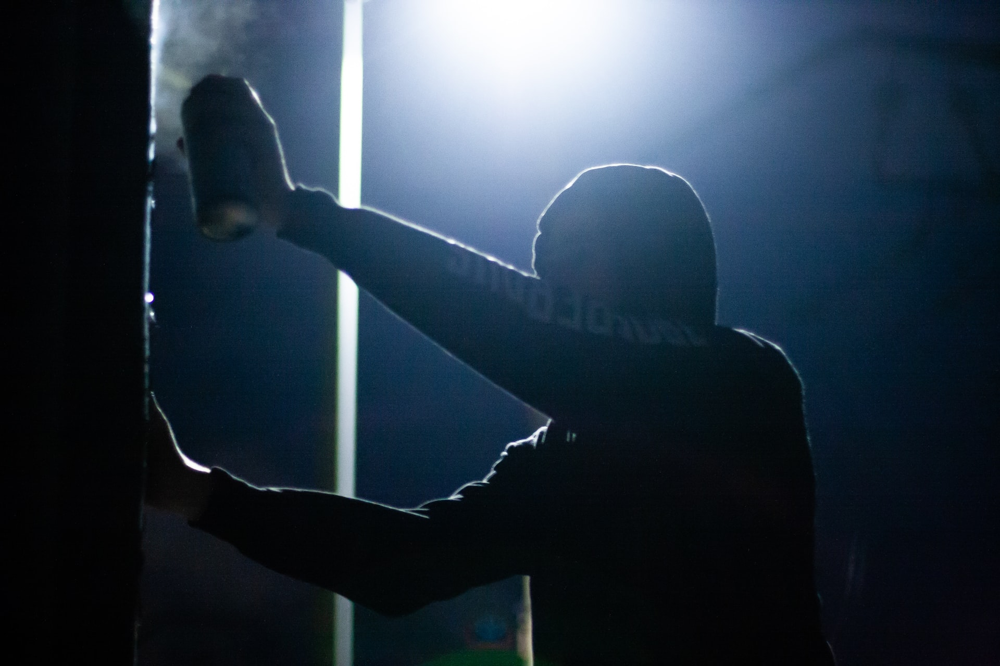
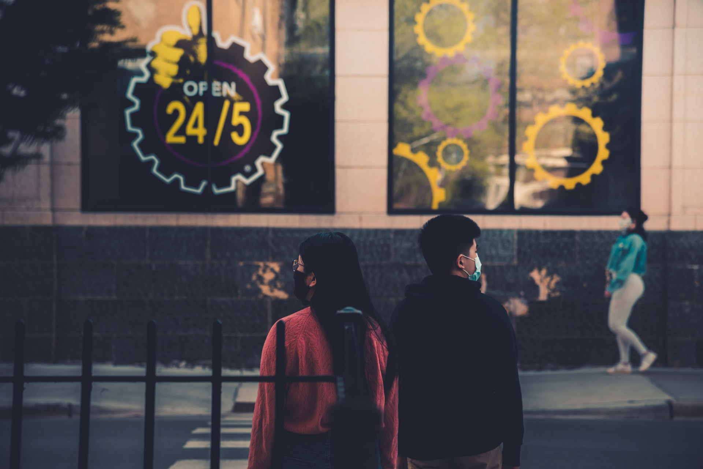
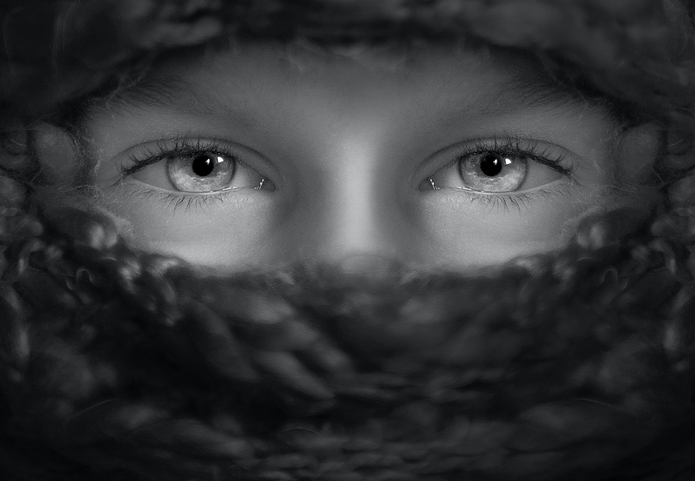
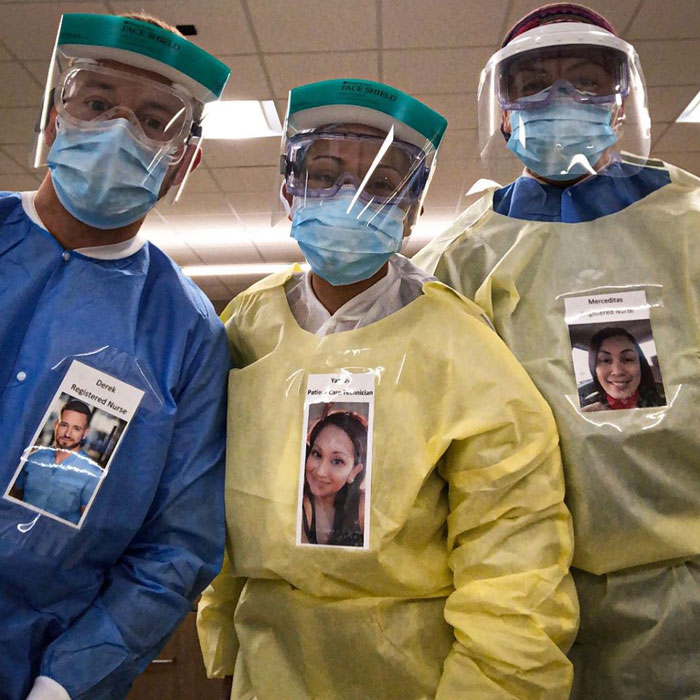
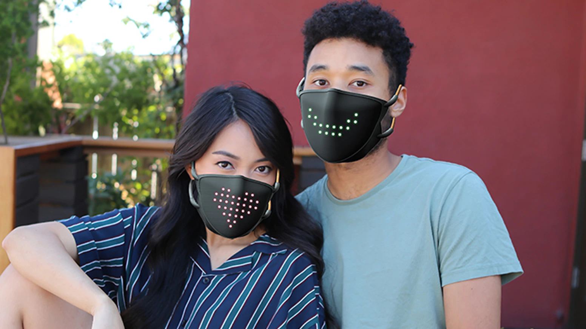
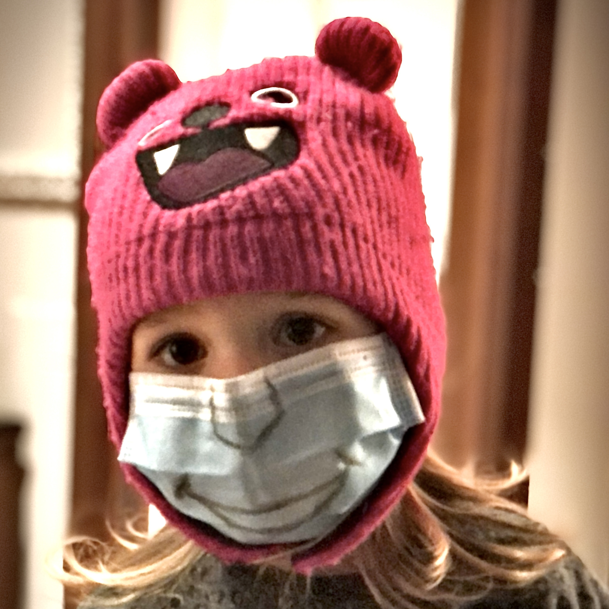

Despite this little beast known as [COVID-19 pandemic](https://en.wikipedia.org/wiki/COVID-19_pandemic) is about to turn 1 year old, many people still feel strange when wearing masks. While wearing a face mask we can't speak properly and we can't see others' mouth, so our experience of a conversation can change, especially if speaking is central in our lives (think of any public figure). Wearing a face mask impacts how we perceive others' emotions as well as our emotions (how we feel). Because our own understanding of our emotions can also influence such emotions in a continuous feedback loop, the effect can go beyond how we feel in that particular moment.

## Summary

Given the central role of verbal and non-verbal communication in social interactions, if wearing a mask affects our abilities to communicate, our social interactions may be affected as well. Fortunately, there's more than just facial features when judging someone's emotions: Voice and body language can convey a good deal of information, which experienced public speakers known how to use to engage with the audience. The impact on social interactions of wearing a mask is hard to assess, however.

I did a brief literature review and then decided to get my hands dirty and replicate some previous experiments on measuring our ability to assess others' emotions, using 45 participants that I recruited through the [Amazon Mechanical Turk](https://www.mturk.com/) platform (for about $80), and [publicly release](https://github.com/phretor/masked-emotions) the collected data (540 data points obtained from 6 headshots of a mid-age man wearing a mask and 6 headshots of a mid-age woman without mask).

The results are not completely in line with previous work: It seems that the batch of participants have performed better (10% better!) at assessing emotions _on masked faces_ than on non-masked faces. This difference may be explained by multiple factors explained below, but my best bet is that Amazon Mechanical Turk workers are mainly profit driven and opportunistic, so they may just randomly click to answer as fast as they could. However, only one participant has clicked the sentinel answer (a deliberately wrong answer I purposely inserted), so, at least they have read the options. Also, I wanted to put the participants under time pressure, giving them only 60 seconds to answer: Actually, our brain is way faster to assess emotions from facial expressions, to the point that it's a subconscious decision.

Overall, when looking at faces, participants took 18.58394 ± 10.18913 seconds on average to take the wrong decision, about 3 seconds slower if compared to when they take a correct decision. The presence of a mask only slightly reflected on timing (16.46097 ± 8.86441 with mask vs. 16.23333 ± 9.44054 without mask), but _correct decisions are taken about 3 seconds faster_. This uncertainty has been found in previous work, too. Just for my own comparison (can't possibly draw any conclusions here!), my 5 year old son never missed a shot when I showed him 6 masked faces and 6 non-masked faces, and took him 3.202 ± 1.469 seconds to assess emotions of non-masked faces vs. 5.364 ± 1.8593 when I showed masked faces. I know, I'm a proud father (very strong bias!) and it's only one data point. Anyhow, despite the difference in the overall performance, both previous (strong and rigorous) research and my little funky experiment confirm that we tend to confuse sadness and disgust for other emotions (including neutral), which are the emotions that are mainly expressed by the muscles around our mouth. And very preliminary data (would be interesting to expand here) on young individuals show that they may be way better than we are at this task.

**Stay safe and be happy:** Wearing mask is essential to protect others—and ourselves, but primarily others! The price at stake here is much higher than a little confusion about others' emotion. Emotions are important, but life is more important! Don't be dumb, don't jump to conclusions (Pytlik, Soll, and Mehl, 2020)! Don't be fooled by this article! Just wear a mask whenever you're in public, especially if you're closed to others but even no-one is around you, because social context has big impact on habits formation! And remember, it's very hard to confusion happiness with any other emotions, even when wearing a mask. So, put a smile beneath your mask!

## How we Decode Emotions Through Facial Expressions

Although a recent study has identified up to 27 types of emotions (Cowen and Keltner, 2017), emotions can be roughly categorized into 6 buckets (Ekman, 1970): anger, disgust, fearless, happiness, neutral, sadness. We as humans process faces “as a whole,” rather than processing individual features individually, and quickly (subconsciously) recognize what emotion the person we're looking at is expressing—whether it is the true emotion or not, that's another story.

This happens even in cultures, such as Saudi Arabia, where veiling is the norm. Remember that certain people, like men and children, do not cover their faces, and women remove their veils at home or in female-only groups. So, humans of all cultures develop the same skills regardless of their public habits. But when we cannot see the whole face, such processing is forced to work with half the facial features (eye region).

Fortunately, each facial feature alone, however, can communicate certain emotions particularly well. The mouth region, for instance, is good for expressing feelings of happiness, although the eye region is also essential (as both previous work and my little experiment have showed). Interestingly, looking at the eye and mouth allows a finer-grained emotion categorization, ranging from sadness and fear (eyes are important here) to disgust and happiness (mouth is the dominant feature).

## Impact on our ability to speak and understand

Another important aspect is that emotions are influenced by—and can influence—our ability to communicate. If we feel we can't properly communicate, we may feel upset or simply uncomfortable that we can’t have a proper conversation because our words sound muffled. But audible speech is only one mean of communication: According to a recent article appeared on [BBC News](https://www.bbc.com/) (Carys Betteley, 2020), members of the deaf community and others with hearing problems struggle if face mask wearing becomes common and widespread. But, let's not forget that millions of women around the world wear face veils every day, with few apparent problems (Ong, 2020). What can we learn from women who veil their faces about how to communicate effectively? I'm quoting a couple of interviews by BBC reporter (Ong, 2020):

> Maria Ali, 34, a homemaker from Rawalpindi in Pakistan who wears a niqab, agrees. She says she has never had any problems communicating with other niqabi women, even ones who are strangers. “With their gestures and voice, you can understand what they mean.”
>
> Marjaan Ali, 23, from Thuwal, Saudi Arabia observes that her facial expressions differ when she has the niqab on. “I’m a bit more exaggerated,” says the recent graduate. “And I’ve noticed that over the years, I’ve learnt to use my eyebrows quite expressively.”

Although we can't certainly generalize from these two quotes, it seems that as long as you learn to use (hand) gestures, voice, and eyes to emphasize your feelings, you can still communicate properly. I couple of times I noticing no reactions while smiling at someone during a conversation, to implicitly communicate my agreement. Moments later I realized I was wearing a mask, so I tried to use hands to do a “thumbs up” sign, or use my eyes to emphasize the masked, nodding smile.

## My Little Funky Experiment

All researches conducted so far seem to confirm that masks prevent us from correctly assessing others' emotions. (Mike Rinck et al., 2020) recruited 91 participants, which showed altered emotion recognition for masked faces when recognizing disgust, fear, surprise, sadness, and happiness, but not anger or neutral expressions. Most of the confusion is on those emotions that share activation of the visible muscles in the upper half of the face. Participants frequently misinterpreted disgust as anger, and fear as surprise. Similarly, (Carbon, 2020) recruited 41 participant assessed the emotional expressions displayed by 12 different faces. Each face was randomly presented with the expressions of the 6 basic emotions while being fully visible or partly covered by a face mask. The researchers have found lower accuracy and lower confidence in recognizing emotions, indicating that emotional reading was strongly impaired by the mask. Specific confusion patterns occur in the case of misinterpreting disgusted faces as being angry, plus wrongly assessing many other emotions as neutral.

After skimming through their results, I got intrigued and wanted to play around with some data as well. But reusing their data to draw the same pictures was not as exciting as repeating the experiment (on a smaller scale, of course). So I set off to work and prepared a survey.

### Collecting data Through Amazon Mechanical Turk

This experiment does by no means substitute rigorous academic research, but after reading the work by (Mike Rinck et al., 2020) and (Carbon, 2020). I really became curious and wanted to create my own analysis. Of course the original survey by (Carbon, 2020) collected way more data than I did, and also made it [available publicly](https://osf.io/3j7q5/). Last time I used Amazon Mechanical Turk was in 2014, so it was time for a quick refresh. It's a powerful platform that allows anyone to quickly collect prepare experiments that require human intelligence and collect data. In about 14 hours I collected 540 data points and that costed me only $80. Of course it's not the same as running in-lab experiments. If you're using Amazing Mechanical Turk, remember to insert test questions (to discard results clearly coming from random, profit-driven clicks) and by choosing to assign tasks only to so-called Master Workers—which are workers with a positive historical record of approved high-quality tasks. There's a [simple intro-level tutorial](https://archive.is/in7QO) that guides you through all the technical steps required to setup and run a survey.



[Figure 1](#figure-facial-expressions-i-used-in-the-experiment-anger-disgust-fear-happyness-neutral-sad) shows the pictures I used in the experiment for each of the 6 universal emotions: anger, disgust, fear, happiness, neutral, sad. I know, I combined two controlled variables in a single experiment (sex and presence of a mask), and that's not a recommended experimental protocol. However, my time and resources were limited, and most of all I'm doing this just for fun and to play around with some data collection and analysis tools. I obtained the data from the [FACES dataset](https://faces.mpdl.mpg.de) (Ebner, Riediger, and Lindenberger, 2010) and I artificially applied a face mask on the pictures of the male model.

### The importance of past experience: People we don't know

I decided to present images to each worker in random order, one at a time, not all at the same time. Why? Because I wanted to emulate the worst-case condition. Here's the rationale: If I know a person I know their “normal” face or “angry” face very well. But if we look at the neutral face above (second from the right), are we 100% that couldn't that be her angry or sad face? If I see the whole context then I have way more context to cast the correct decision—especially if I know there are 6 emotion types.

In other words, if I know a person, even when that person wears a mask, I can easily tell their emotions apart. But I was more interested in emulating the “random stranger” condition: Imagine you're walking on the street and a person you've never seen before walks toward you with a sad-looking face—or angry-looking face, who knows! How good are you at telling those two very different emotions apart? Anger and sadness are quite different emotions, but because of the mask and the complete lack of past experience you simply can't guess. It's the worst-case condition and I wanted to emulate exactly that.

Following the same line of thought, I decided to impose a 60s time constrain for workers to complete each task (1 face). Why is timing important? Because when we glance at someone's face we make unconscious decisions and those are quite fast. (Carbon, 2020) gave the participants “unlimited” time to complete the task and collected a conscious assessment of their “confidence” in their decision. I decided to focus on a fast task, because at the end of the day, that's how our brain works when we see someone.

### Results: How Good are we at Detecting Emotions from Facial Expressions?

As the following figure shows, I obtained mixed results, sometimes opposite from what previous (and more thorough) work has found. In most of the times, as the green diagonal shows, the emotions where correctly classified, with more confusion in the masked case (bottom row). In particular, we notice that happiness is a “strong” emotion, in the sense that it almost never got misclassified (only 4 cases out of 270 in the masked condition, and zero cases in the unmasked condition). So, smile whenever you can! Sadness and disgust are particularly challenging emotions, especially in the masked condition, and neutral got misclassified 10% of the times for other emotions—mainly anger—in the unmasked condition. Surprisingly, neutral emotions appear more neutral in the masked condition. Does masks make us all appear more serious? Maybe!



The overall performance for correctly detecting facial emotions in faces without masks was 70.00% (while 89.5% in (Carbon, 2020)). Presenting a different face (to reduce the effects of learning, or simply cheating) resulted in a 79.25%. Yes, the workers—assuming they didn't cheat (and that's a big assumption)—performed better when presented with masked faces. This is the opposite of what (Carbon, 2020) found, but I'm skeptical of my own data. There may be various explanations and the only way to give a clear answer is to repeat the experiments several times, but I simply don't have enough time to dig further, so I'm just providing some wild guesses. Maybe someone will do some followup work.

- **Small sample and multiple controlled variables:** to keep the investment below $100, I had to reduce the number of stimuli to 1 mid-age man for masked faces, 1 mid-age woman for non-masked faces, while the original study has employed all variants (male vs. female w/ and w/o mask): it's an experimental mistake to combine multiple variables, because now we don't know whether the reason is that the non-masked woman model was less expressive or, vice-versa, the masked man had very expressive eyes;

- **Time:** the time pressure may have forced the workers to simply cast a random choice or the workers may have taken the tasks in a very opportunistic way. However, if we pivot the data, we see that, overall, they make sense (see the timing analysis below).

- **We've grown accustomed to this!** Hey, let's look at the bright side of it: the 45 participants may have gotten better at assessing emotions by looking at the eyes only. Not really sure this is the case, but I gave it a thought for a moment.

Lots of open questions and little time to continue this research. But it was fun to learn how to deploy this type of studies from scratch. Next time I'll certainly think twice and/or invest more resources to conduct wider studies. Let's move onto the timing analysis now.

### Results: How Fast do We Process Facial Expressions With and Without Masks?

My 5 year old son never misclassified a facial expression when I showed him 6 masked faces and 6 non-masked faces, and took him 3.202 ± 1.469 seconds to assess emotions of non-masked faces vs. 5.364 ± 1.8593 when I showed masked faces. This initial home experiment got me into thinking I should look at the time spent by the workers to complete their task. Big warning: this time includes the time required to click on the next page, wait for the page to load, and finally click on the “submit” button. So, let's look at it but take it with a grain of salt.

As we can see from [Figure 3](#figure-overall-time-to-detect-facial-emotions-in-case-of-correct-blue-and-incorrect-false-detections), regardless of whether one's wearing a mask, correct detections overall take about 3 second less than incorrect ones (15.60794 ± 8.65164 versus 18.58394 ± 10.18913). Also, we can see that participants who didn't detect the correct emotion from facial expressions spent a highly variable time staring at the picture, while timing for correct detections are more densely distributed around mean values.



Looking at the breakdown in [Figure 4](#figure-breakdown-on-real-emotions-displayed-on-the-stimuli) we see that the mask condition (bottom row) almost always means the subject will spend some more time to look at the picture and still make the incorrect guess. Some facial expressions seem to create more confusion than others: look at fear or neutral for example. When presented with unmasked facial expressions (upper row), the subject will spend roughly the same amount of time, regardless of the outcome (correct vs. incorrect), while in the bottom row we see more diverse cases.



## Survival, adaptation, and crime

Since our earliest days, human beings have been incredibly attuned to reading the facial expressions of others. This ability likely conferred upon us an evolutionary advantage, Charles Darwin (Darwin, 1872)Learning how to read emotions from a face could aid social interaction, reduce misunderstandings and help a group function efficiently and harmoniously for the greater good, said (Ong, 2020).

[Eilidh Noyes](https://pure.hud.ac.uk/en/persons/eilidh-garvey), lecturer in cognitive psychology at the [University of Huddersfield](https://hud.ac.uk) in northern England said that

> When you see a face you do two things at once. You try to work out the identity: Do I know them? How do I know them? And you try to read their emotions. [...] Emotion recognition is important from an evolutionary perspective as it helps us gauge threat and can also facilitate positive social interactions. That’s true of both people we know well and those we have never met.

Similarly, [Ian H. Robertson](https://www.tcd.ie/research/profiles/?profile=iroberts), professor of psychology at [Trinity College Dublin](https://www.tcd.ie) said that

> For survival reasons, you need to know what someone’s intentions are when you meet them. Not being able to do that easily will naturally make people more cautious and defensive, which in some cases could, unfortunately, lead to violent confrontations.

Source: (CORDIS, 2020).

Understanding others' emotion has been a matter of survival, but not as much as in ancient times. So there's no doubt it's important to assess emotions correctly, but only in certain, very extreme situations, when normally there are other clues available: A loud screaming voice to signal emergency would be understood as fear no matter what. So, overall, I don't agree with this line of thoughts and I consider it very borderline if not biased.

I do agree with the fact that with mask becoming the norm there is the potential for exploitation by those with criminal intentions.

> The main problem that people wearing masks throws up is the sheer volume of people suddenly covering their faces

said [Francis Dodsworth](https://www.kingston.ac.uk/staff/profile/dr-francis-dodsworth-241/), senior lecturer in criminology at [Kingston University London](https://www.kingston.ac.uk).

> It could create opportunities for people who want to cover their face for nefarious reasons. They could potentially now do so without raising suspicion.
>
> Concealing faces will also have widespread implications for crime and security. A lot of witnessing is already problematic. Even when a group of people witness the same crime, one person will see someone with a mustache and a hat, while another will see someone with a beard and sunglasses.”

Source: (CORDIS, 2020)

## Social impact of wearing masks and change in emotions

I still feel a little strange when wearing a mask, but my rational part is now in full control of those mixed emotion, and I simply forget I'm wearing a mask at times. In May, [Kate Gray](https://www.reading.ac.uk/pcls/staff/katie-gray), who researches emotion processing at the [University of Reading](https://www.reading.ac.uk/) in the UK, mentioned that adapting to a faceless society will be a smooth process: _“[...] we’ll quite quickly get used to picking up social and emotional cues from voice cues or body language.”_

I remember that the first time I saw my father wearing a mask it felt very strange. And when I started wearing a mask and people around me wouldn't, I felt even stranger—like I was over-reacting. I bet I wasn't the only one feeling strange, and an early research appeared earlier this year scientifically confirmed that the simple exposure to social groups of mask wearers greatly reduces that strange feeling (Carbon, 2020). The researchers have asked 86 participants to assess how strange they felt when wearing a mask (i.e., simple surgery mask, FFP2 mask, and loop scarfs) among other mask wearers, in groups of varying size. The larger the social group, the less strange each member feels about themselves.

So, one part of the impact on emotion seems to be that wearing masks makes us feel a little different, triggers different or slightly different emotions. When we wear a mask we’re left only with the eyes, and that can make it difficult for people to make these judgments. According to [Leslie Zebrowitz](https://www.brandeis.edu/facultyguide/person.html?emplid=2eb6be94b388be4b500e54ef726277fd747f02bb), psychology professor who studies facial perception at [Brandeis University](https://www.brandeis.edu), told that _“We feel more comfortable when we feel that we’re able to assess what someone is like”_ (CORDIS, 2020).

## A face mask can help you conceal unauthentic (or social) emotions

Here's another line of thoughts I tend to agree with, probably because I'm introvert. We—introvers—won't be showing our true emotions anyhow, with or without mask, so why bother? We don’t have to be happy to smile, and we don’t always smile when we’re happy. This can vary greatly across cultures. In the United States, smiling is part of the etiquette, while a [Russian proverb translates as _“smiling with no reason is a sign of stupidity.”_](https://archive.is/wip/vm2kd) In Japan, emotions are stifled in public, there’s a greater emphasis on smiling with the eyes, so Japanese people may be able to convey—and read—their emotions through facial expressions more effectively.

Tara Well, Associate Professor of Psychology at Barnard College of Columbia University, recently wrote a short thought piece about the social smile (Tara Well, 2020). She wrote that:

> The social smile is activated in the mouth muscles only and, therefore, easily covered up by a face mask. But a genuine smile, known as the Duchenne smile, named after the French anatomist who discovered it, involves both the mouth and the eyes. Interestingly, the facial muscle engaged by a genuine smile, called the orbicularis oculi, can’t be activated on command. You can see an authentic smile in the crinkles around the eyes.
>
> According to this, the face mask only hides the fake smiles, not the authentic ones. Think about it: when you're truly smiling (close to laughing), extending your mouth isn't enough. On the other hand, when you make a forced smile, it's istantaneous, and it only involves the muscles around your mouth. Prof. T. Well continues explaining how, for some personality types, wearing a mask may even have a beneficial impact in their emotional space:
>
> Those suffering from social anxiety may welcome wearing face masks precisely because _they prefer to veil their emotional state from the outside world as much as possible_. [...] Others appreciate the freedom from the obligation to put others at ease with a warm, friendly smile. By wearing a face mask, you don’t have to smile if you don’t feel like it.
>
> We learn when to show and hide our genuine emotions from early face-to-face exchanges. Parents instinctively want to shield their children from negative social experiences. So they reward emotional displays that will encourage and facilitate acceptance from others. Children learn to behave in specific ways to receive social approval. Part of this process is developing a social smile to hide unacceptable emotions. (see book on negative factors of this).
>
> The social smile is often activated automatically. We may not be fully aware of it. We might smile reflexively to put the brakes on showing too much negative emotion in public. We may maintain a calm, relaxed smile to prevent fear from upwelling and getting the best of us. We can also intentionally use the social smile to pepper our communication—like smiling, assuringly at someone who appears suspicious of us.

I'm among those who “suffer” when the social “norm” ask us to smile or simply for an emotion, so I like this viewpoint. An Asian friend a few years ago told me some Asian people cover their faces with a mask or scarf loop not only during flu season, but simply beacuse they don't always want to show their mouth area or full face in public. Whether or not that's a bias in his social circle, I sometimes feel the same.

## Is Eye-only Emotion Communication Possible?

Shakespeare said that the eyes were the windows to the soul. Indeed, eyes alone can provide a great deal of information. [Nigel Holt](https://www.aber.ac.uk/en/psychology/staff-profiles/listing/profile/nih12/), Professor of Psychology at [Aberystwyth University](https://www.aber.ac.uk) recently wrote (Holt, 2020) that “we are wired to extract information from the eyes—information that can help us assess the emotions of those around us and so allow us to engage more effectively with them.” Eyes alone can be quite effective, as (Lee and Anderson, 2017) showed. They showed volunteers images of eyes expressing different emotions (sadness, disgust, anger, joy, surprise, fear) and found out that the participants were able to correctly guess the mental states to the “eye expression”. From this research it emerged that different aspects of the eyes (such as how open they are or how sloped the brow is) give information about different mental states.

Eye contact is also essential in social interactions as well as in the emotions that gazing at eye level can trigger. (Guastella, Mitchell, and Dadds, 2008) showed images of faces to people who are given oxytocin, and found out that they spend more time looking at the eyes than those given a placebo. Since oxytocin is a factor in social interactions, this finding suggests the eyes are very important in how we understand our engagement and interaction with those around us. Indeed, people with high levels of oxytocin appear to seek out the eyes to help them better engage socially with others.

From a perception viewpoint, we know that we are exceptionally sensitive to very tiny changes in direction of gaze, because the center of our retina is densely populated with light receptors. But a recent study showed that this goes beyond just sensitivity and perception. When we try to assess which direction someone is looking in, it significantly activates our amygdala, a part of the brain associated with emotion. So there seems to be a link between emotion and eyes at a neurological level (Kawashima et al., 1999).

When eyes are the only feature available the role of the context could be crucial, but there's no strong evidence about this.(Kret and de Gelder, 2012) tested whether emotions can be recognized when just the eyes are visible and whether this recognition is affected by context cues (e.g., various Islamic headdresses vs. a cap or a scarf). The results are that fear is still well recognized from a briefly flashed (100 ms) image of a women wearing a burqa with less than 20% transparency of the eye region.

Last, let me bring up a different viewpoint on eye-only emotion communication. It's somewhat common belief that if someone is “looking up and to the right” when they are talking then they may be lying. (Wiseman et al., 2012) filmed a group of people telling true and false stories, and then asked another group to try to spot the lies by looking at the speakers’ eyes. This experiment found no evidence for a link between lying and eye movements at all. So, eye-only emotion communication is possible, but not as reliable as one may think.

## How to better communicate when wearing masks?

Some [healthcare workers on the frontline have attached smiley-faced pictures of themselves](https://www.boredpanda.com/doctor-portraits-on-protective-gear/) onto their medical gowns, trying to ease patient anxiety (Ong, 2020). That's one practical and simple way to show your best emotion (happyness) when people around you need that. Especially when we can't talk, I don't see any better way than that.

But when we can talk and move freely, it's a whole different story. Psychologist Al Zayer suggests that, when wearing a mask, we should strive to over-communicate, use more words than we normally would, and ask more questions, to make sure we're picking up on the other person’s emotions. Isn't that what professional radio speakers or podcast creators do? They can convey very deep emotions and many shades of emotions by using their voice only. Normally, facial expressions form part of a coordinated set of features—including hand gestures, body language, words, pitch and tone, and even face colour (Benitez-Quiroz, Srinivasan, and Martinez, 2018). All of these features act together to convey message, intent, and emotions. And the best part is that, for some people, this is all natural. No training needed!

I want to close with a fun fact. There are [prototypes of a voice-activated mask, currently in the crowdfunding stages](https://archive.is/wip/SAyaJ) (Georgia Coggan, 2020). The mask uses LED lights to display emotion or words. The LED lights can mimic the mouth movements, with simple commands like “popping the lips” to display simple words, emojis or smiles.

The artificial mouth tracks the mouth of the user, emulating the physical action of the lips. It's a matter of time and someone will make the flexible OLED version of that, showing a full, high-resolution picture of your mouth area recorded in real time from a micro-camera with IR illuminators positioned inside the mask.

For now, I'm sticking to the old-school approach.

## References

- Baron-Cohen, Simon, Sally Wheelwright, Jacqueline Hill, Yogini Raste, and Ian Plumb. “The ‘Reading the Mind in the Eyes’ Test Revised Version: A Study with Normal Adults, and Adults with Asperger Syndrome or High-Functioning Autism.” The Journal of Child Psychology and Psychiatry and Allied Disciplines 42, no. 2 (February 2001): 241–51. https://doi.org/10/fdwnm3.
- Benitez-Quiroz, Carlos F., Ramprakash Srinivasan, and Aleix M. Martinez. “Facial Color Is an Efficient Mechanism to Visually Transmit Emotion.” Proceedings of the National Academy of Sciences 115, no. 14 (April 3, 2018): 3581–86. https://doi.org/10/gdb3m5.
- Carbon, Claus-Christian. “The Psychology of Wearing Face Masks in Times of the COVID-19 Pandemic.” SSRN Scholarly Paper. Rochester, NY: Social Science Research Network, April 24, 2020. https://doi.org/10.2139/ssrn.3584834.
- Carbon, Claus-Christian. “Wearing Face Masks Strongly Confuses Counterparts in Reading Emotions.” Frontiers in Psychology 11 (September 25, 2020). https://doi.org/10/ghp92r.
- Carys Betteley. “Coronavirus: Mask Wearing ‘risks Isolating’ Deaf People.” BBC News, May 14, 2020, sec. Wales. https://www.bbc.com/news/uk-wales-52659083. [Archived copy](https://archive.is/L3TKW).
- CORDIS. “Are Masks the New Face of Our Society? Science and the Changing Landscape of Human Expression | News | CORDIS | European Commission.” News. Trending Science. Community Research and Development Information Service (CORDIS), May 28, 2020. https://cordis.europa.eu/article/id/418273-human-expression ([Archived copy](https://archive.is/wip/SCjDP)).
- Cowen, Alan S., and Dacher Keltner. “Self-Report Captures 27 Distinct Categories of Emotion Bridged by Continuous Gradients.” Proceedings of the National Academy of Sciences 114, no. 38 (September 19, 2017): E7900–7909. https://doi.org/10/gfhzd2.
- Darwin, Charles. The Expression of the Emotions in Man and Animals. J. Murray, 1872.
- Ebner, Natalie C., Michaela Riediger, and Ulman Lindenberger. “FACES—A Database of Facial Expressions in Young, Middle-Aged, and Older Women and Men: Development and Validation.” Behavior Research Methods 42, no. 1 (February 1, 2010): 351–62. https://doi.org/10/ftbs4j.
- Ekman, Paul. “Universal Facial Expressions of Emotion.” California Mental Health Research Digest 8, no. 4 (1970): 151–58.
- Georgia Coggan. “Incredible New Face Mask Displays Your Emotions.” Creative Bloq, September 2020. https://www.creativebloq.com/news/led-face-mask. [Archived copy](https://archive.is/wip/tIVaO).
- Gorvett, Zaria. “There Are 19 Types of Smile but Only Six Are for Happiness,” April 10, 2017. https://www.bbc.com/future/article/20170407-why-all-smiles-are-not-the-same. [Archived copy](https://archive.is/wip/vOfcc).
- Guastella, Adam J., Philip B. Mitchell, and Mark R. Dadds. “Oxytocin Increases Gaze to the Eye Region of Human Faces.” Biological Psychiatry, Schizophrenia: From Genetics to Treatment, 63, no. 1 (January 1, 2008): 3–5. https://doi.org/10/c8mvmg.
- Holt, Nigel. “Face Masks: Why Your Eyes Might Be Saying More than You Realise.” The Conversation, September 1, 2020. http://theconversation.com/face-masks-why-your-eyes-might-be-saying-more-than-you-realise-145076.[Archived copy](https://archive.is/wip/A1yfF).
- Kawashima, Ryuta, Motoaki Sugiura, Takashi Kato, Akinori Nakamura, Kentaro Hatano, Kengo Ito, Hiroshi Fukuda, Shozo Kojima, and Katsuki Nakamura. “The Human Amygdala Plays an Important Role in Gaze Monitoring: A PET Study.” Brain 122, no. 4 (April 1, 1999): 779–83. https://doi.org/10/dsqnk6.
- Kret, Mariska Esther, and Beatrice de Gelder. “Islamic Headdress Influences How Emotion Is Recognized from the Eyes.” Frontiers in Psychology 3 (2012): 110. https://doi.org/10/ghp92q.
- Lee, Daniel H., and Adam K. Anderson. “Reading What the Mind Thinks From How the Eye Sees.” Psychological Science 28, no. 4 (April 2017): 494–503. https://doi.org/10/f942wj.
- Mike Rinck, Maximilian Primbs, Iris Verpaalen, and Gijs Bijlstra. “The Effect of Face Masks on Facial Emotion Recognition.” Behavioural Science Institute, 2020. https://www.ru.nl/bsi/covid-19-bsi-studies/effect-face-masks-facial-emotion-recognition/. [Archived copy](https://archive.is/wip/D9xhK).
- Ong, Sandy. “How Face Masks Affect Our Communication.” BBC Future, June 8, 2020. https://www.bbc.com/future/article/20200609-how-face-masks-affect-our-communication. [Archived copy](https://archive.is/wip/S3wvO).
- Pytlik, Nico, Daniel Soll, and Stephanie Mehl. “Thinking Preferences and Conspiracy Belief: Intuitive Thinking and the Jumping to Conclusions-Bias as a Basis for the Belief in Conspiracy Theories.” Frontiers in Psychiatry 11 (2020). https://doi.org/10/ghpdjv.
- Tara Well. “Do Face Masks Really Conceal Emotions?” Medium, August 4, 2020. https://medium.com/@tarawell/do-face-masks-really-conceal-emotions-98a7bfe3af66. [Archived copy](https://archive.is/wip/q180I).
- Wegrzyn, Martin, Maria Vogt, Berna Kireclioglu, Julia Schneider, and Johanna Kissler. “Mapping the Emotional Face. How Individual Face Parts Contribute to Successful Emotion Recognition.” PLoS ONE 12, no. 5 (May 11, 2017). https://doi.org/10/f9699b.
- Wiseman, Richard, Caroline Watt, Leanne ten Brinke, Stephen Porter, Sara-Louise Couper, and Calum Rankin. “The Eyes Don’t Have It: Lie Detection and Neuro-Linguistic Programming.” PLOS ONE 7, no. 7 (July 11, 2012): e40259. https://doi.org/10/kxh.

## Image Credits

In order of appearance:

- Photo of person walking on a boat by [Zakaria Zayane](https://unsplash.com/@kaziiparkour?utm_source=unsplash&utm_medium=referral&utm_content=creditCopyText) on [Unsplash](https://unsplash.com/s/photos/stranger-look?utm_source=unsplash&utm_medium=referral&utm_content=creditCopyText).
- Photo showing dark scenery with an unrecognizable person by [Peter Scherbatykh](https://unsplash.com/@sm83?utm_source=unsplash&utm_medium=referral&utm_content=creditCopyText) on [Unsplash](https://unsplash.com/s/photos/crime?utm_source=unsplash&utm_medium=referral&utm_content=creditCopyText).
- Photo of a person in a hoodie by [Patryk Sobczak](https://unsplash.com/@patryksobczak?utm_source=unsplash&utm_medium=referral&utm_content=creditCopyText) on [Unsplash](https://unsplash.com/s/photos/lonely?utm_source=unsplash&utm_medium=referral&utm_content=creditCopyText).
- Photo of eyes closeup by [Kat J](https://unsplash.com/@kj2018?utm_source=unsplash&utm_medium=referral&utm_content=creditCopyText) on [Unsplash](https://unsplash.com/s/photos/eyes-only?utm_source=unsplash&utm_medium=referral&utm_content=creditCopyText).
- Photo of healthcare workers by [derekdevault](https://www.instagram.com/derekdevault/) (via [boredpanda.com](https://www.boredpanda.com/doctor-portraits-on-protective-gear/?utm_source=google&utm_medium=organic&utm_campaign=organic))
- Photo of JabberMask by [tyler Glaiel](https://twitter.com/TylerGlaiel)
