I guess it's not unique to the cyber-security world, but research and media move pretty fast here, so it's easy to end up with hundreds of seemingly interestingly articles or blog posts to read every day. Of course, that's not humanly possible. Let me tell you how I deal with this with only two tools, [Inoreader](https://inoreader.com) and [Zotero](https://zotero.org), plus some scripting.

In [CyberFacts Weekly Issue 0x03](/cyberfacts/issue-3/) I briefly hinted about this workflow, which surprisingly have inspired one of my subscribers to follow the same approach to curate their own newsletter (cool!). This motivated me to spend some time and write down the details of the workflow, in the hope that curators and newsletter authors would find it useful.

**DISCLAIMER:** I don't care about building an audience nor monetizing this. I do this to fuel my thirst for research ideas. Admittedly, I like to pretend there is an audience, which keeps me motivated to keep maintaining this.

## Why Curated Content?

Good research starts with good knowledge of the environment, state of the art, and key people. I guess it's not unique to the cyber-security world, but **research and media move pretty fast** in this field, so it's easy to end up with hundreds of seemingly interestingly articles or blog posts to read every day. Of course, that's not humanly possible. And this is without including social media and fake news "drifts" in the picture.

Hand curation services and newsletters have became very popular as a mean for **busy people** to stay on top of things, letting curators filter noise from the signal: [Dragon News Bytes (DNB)](https://lists.cymru.com/mailman/options/dragon_newsbytes), [SANS Newsbites](https://www.sans.org/newsletters/newsbites/), [Unsupervised Learning](https://danielmiessler.com/newsletter/), [tl;dr sec](https://tldrsec.com/), [CloudSecList](https://cloudseclist.com/), and [Guerre di Rete](https://guerredirete.substack.com/) are some of those I read.

## No Silver Bullet Curation

I've learned there's **no silver bullet** in content curation: Some of these digests are lightly processed, some are more processed and include analyses, some fit my research topics, some completely miss some key stories I need to know about. Some newsletters are too high level (but contain good pointers!), while some other newsletters are too narrow.

While there are some must-read stories every week (which are found in the set-intersection between all good newsletters), each one of us has their own style and need to build their own opinion, independently, through autonomous content sourcing. Regardless of how good some newsletters are, even paid ones, I've always ended up not finding something I wanted in each one of them. So, while being an avid consumer of newsletters, a few years ago, I felt the need to understand more of how research results develop into news stories as a mean to build my own view. After all, traditional media outlets and socials cover a very important and critical role of research dissemination, with the responsibility of making the difference on public opinion around a cold research result.

## From Consuming to Creating

I decided I wanted to get to the source of each news I read. So, I started to systematize my reading list into a taxonomy and, month over month, I've been feeling I'd improved the way I consume readings, gaining more confidence in the difficult task of telling apart interesting from non-interesting news stories. I mean, interesting for my work, of course. Sometimes my work is interesting to the public, so, very seldom, *my* noteworthy news stories are interesting for others, too.

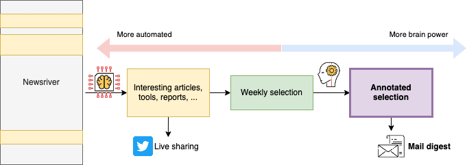

Let me now tell you how I deal with the ever-growing amount of reading material, having only a few minutes a day, often with more important work-related tasks to do.

## High-Level Pseudo Workflow: No Tools, Yet

Without going down into the tooling and details, yet, my workflow can be boiled down to the following steps.

1. **Sources of content:** newspapers, mainstream media outlets, press releases, official and personal blogs, public and private social media feeds, bulletins, content aggregators, other curated content. I organize my sources in a taxonomy with overlapping categories (e.g., a source can be both marked as "Must read" as well be in a broader "Infosec Relevant" category), by topic, and by importance.
1. **Discovery of new sources:** when I encounter an interesting story (e.g., shared by someone else via social media) and I notice I didn't know about that source, I find a place for it within my taxonomy of sources.
1. **Systematize and prioritize sources & topics:** every time I feel I can't find a good place for a new source, I revise my taxonomy of sources, get rid of inactive or noisy sources, re-sort, etc. I organize my taxonomy in sorted folders from the most important topic-folders (top) to the most generic ones (bottom). In 3 years I've done this spring cleaning probably twice, so it's not a lot of work.
1. **Automatic filtering, "bucketization," and tagging:** All items are first globally de-duplicated (so that I don't happen to read the same item twice, not even by accident), slightly filtered to reduce noise (e.g., I'm not interested in Q&As or AMA posts on Reddit, replies to Tweets), bucketized into topic-folders, and automatically tagged for interesting keywords (e.g., tracked topics, people, places, software names).
1. **Skimming through buckets:** The way my sources are organized is such that I don't have to choose what to read. The top buckets will always appear at the top, and as I mark them as read, they'll disappear from the current bucket, and from any other overlapping buckets below.
1. **Select interesting articles:** When I find an interesting item, I tag it as "Noteworthy," which triggers automatic archival and immediate sharing (e.g., on Twitter). I have private chats with co-workers where I share the same (or slightly different) content. I create one tag for each one of these cases so I can manage their workflows independently.
1. **Share and track:** When the content get shared via my social media channels, I receive notifications when people comment, re-share, or like, which gives me an indication of how good my choice was. Also, when I select an item about a completely new (but very important) topic, I setup auto-tagging of that topic, so that I get notified when something about that topic pops in the news again.
1. **Sort content selection:** Every 1-2 days, I go through my "Noteworthy" items and, also based on feedback from social media (if any), I choose the absolutely most important items and read through them in my browser.
1. **Annotate selected content:** While reading, I take an HTML snapshot and save a copy of the page so that I can annotate and archive locally.
1. **Highlight and summarize:** While reading, I highlight the most important pieces and start thinking about a one-liner to summarize the story, which may happen to be the same title chosen by the original reporter.
1. **Digest:** Every week, I spend 30' to organize the selected content into 3+ groups: top most important items, also important, tools, and some other ad-hoc groups (e.g., vulnerabilities) as the content demands.
1. **Share:** From the weekly selection, I have automatic scripts that generate a Markdown file containing an intro I write (there go my 30'), table of content, summary, and list of grouped items; that file is then converted into HTML and summaries for Twitter and LinkedIn.
1. **Maintain:** And that used to be the hardest part, but most of this workflow is automated, so I can focus of what I'd do anyhow: reading!

## From Research to Headline: A Simplified Journey

At times my work gets picked up [^pickup] by the media, so I've seen how things work from both sides of the journey. What follows is not the complete picture, but just a quick summary as a pre-requisite to better appreciate the rest of this post.

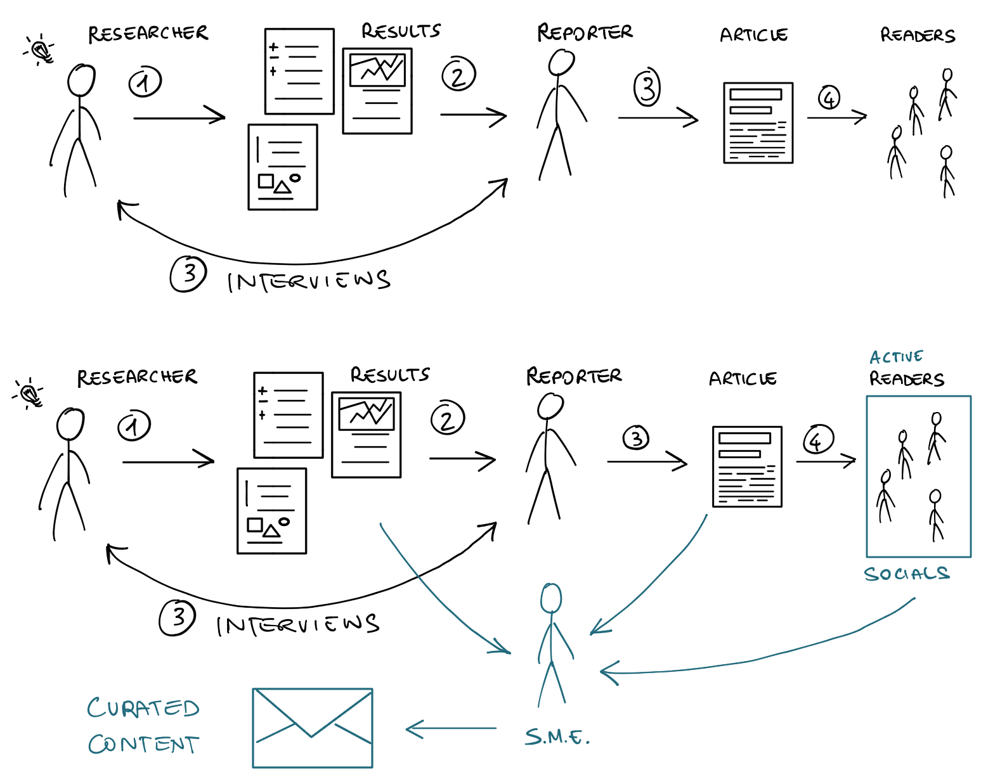

In the diagram above you can see the changes induced by massive use of social media. Despite the simplicity of the diagram, the effects are relevant.

- **Idea genesis:** Researchers have ideas all the time, while discussing with colleagues or reading others' work. Due to resource constraints, not all ideas get developed.
- **Research development:** Research ideas are developed into research projects, which ultimately lead to results (good or bad). Some results are written into more or less scientific reports or white papers for the general public or special interest groups.
- **Embargoed content and press releases:** If a researcher (or their organization) deems that a research result is important and want to make mediatic noise about it, they can decide to contact a trusted reporter, directly or indirectly, or prepare a press release (the latter is the norm for large organizations). The same concept applies to coordinated vulnerability disclosure.
- **Public peer-reviewed publication or conference talk about results:** Independently from, but usually in coordination with, release via media outlets, original and important research results are submitted for reviewed venues (e.g., scientific or non scientific conferences), which may end up selecting them for publication, usually including a public speech.
- **First media article publication:** Depending on the agreements with the reporters, the cat gets out of the sac. The research becomes public news, although who needed to know (e.g., target of an attack, vendors of a vulnerable product, breached account holders) already knew, which creates the possibility of leaks.
- **Follow-up news articles:** Other reporters discover about interesting articles and write their own take, potentially interviewing other experts, develop other angles of the story, make connections, etc. This creates many near-duplicates or updates to te original story.
- **Social amplification and content aggregation:** The many verses have their say about relevant news, and usually comment a lot when something interesting pops up, create aggregation pages, and so on.
- **Readers content consumption:** Finally, the readers, the intended audience, gets a chance to read the original story, or one of the many derivatives.

And we're here, we're all content consumers. Some of us are producers, but we can't just not being consumers. Content creators and curators, especially if they're subject matter experts (SME), want to go the source of a content, potentially all the way back to the original research material. I think this is the key to good content curation: Find the right balance between looking at the source while listening to output of the following steps. Or, in other words, it's important to follow a reporter, but even the best reporters can make mistakes or omit details because they need to summarize.

[^pickup]: I don't like this term, because more often then not, content is "pushed" to the mainstream media. Few people know about this fact and most people think that reporters have infinite time to consume all available resources.

## The Workflow: For the Impatient

It's now time to dig into the details of how we can start curating our interesting content. From now on, I'll write about the tools and approaches that I use.

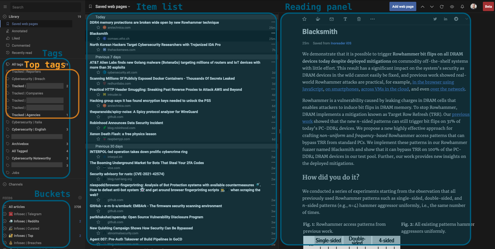

I use Inoreader for 99% of my readings and archival, and Zotero for local archival and newsletter editing. Inspired by Marco Lancini's CloudSecList, which [uses a JSON file](https://www.marcolancini.it/2020/blog-serverless-mailing-list/) to hold the data of each issue, I use Zotero's auto-generated JSON files for the same purpose, with some post-processing.

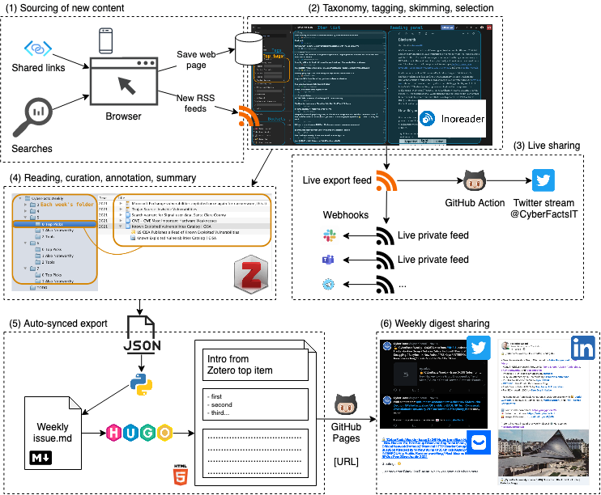

### Sourcing: Discovering, Organizing, and Consuming Good Sources (1-2)

My sources include global and local newspapers (there's more than just cyber-security), mainstream media outlets, press releases, official and personal blogs, public and private social media feeds, bulletins, content aggregators, other curated content. Roughly, I split sources in the following macro groups:

- **New sources** I monitor to see how I like them; this group include newly discovered sources that I put in "beta testing"; usually, they stay in this group for a few weeks.
- **Top stuff** I absolutely must read; this group includes RSS feeds from renowned voices in the cyber-security field (e.g., Bruce Schneier, Brian Krebs), top outlets (e.g., Engaged, WIRED, Forbes), top technical blogs (e.g., Google Project Zero), etc.
- **Specialized sources** that are relevant and low-noise, but one step after the top sources; this include newsletters or digests, the [r/netsec](https://reddit.com/r/netsec) sub-reddit, [Techmeme](https://www.techmeme.com), pure feeds (e.g., vulnerability feeds, news from law enforcements), and press releases from top tech companies.
- **Non-specialized sources**, which include tech outlets like Gizmodo, Engaged, hand-curated world news (e.g., via [Mediagazer](https://www.mediagazer.com)), personal blogs, trending GitHub repositories, official blogs of top tech companies, etc.
- **All the rest**. Why do I keep this? First of all because I want to be able to globally search on everything. Secondly, if a news is really important, it will travel far, far away, event to the local free newspaper. So, monitoring the least-popular sources will give you indirect confirmation that something is *really* good, if you know how to interpret signals.

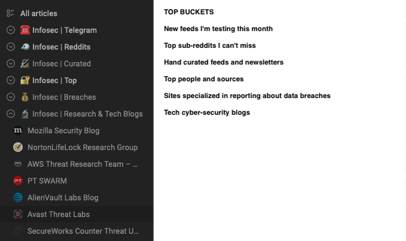

I organize my sources in a taxonomy with overlapping categories (e.g., a source can be both marked as "Must read" as well be in a broader "Infosec Relevant" category), by topic, and by importance.

When I encounter an interesting story (e.g., shared by someone else via social media) and I notice I didn't know about that source, I find a place for it within my taxonomy of sources.

### Taxonomy, tagging, skimming, selection (2)

I spent a good full day in 2018 to think about how I reacted on keywords, and came up with a taxonomy of keywords that fit my reading habits. I revised it twice over the past 3 years.

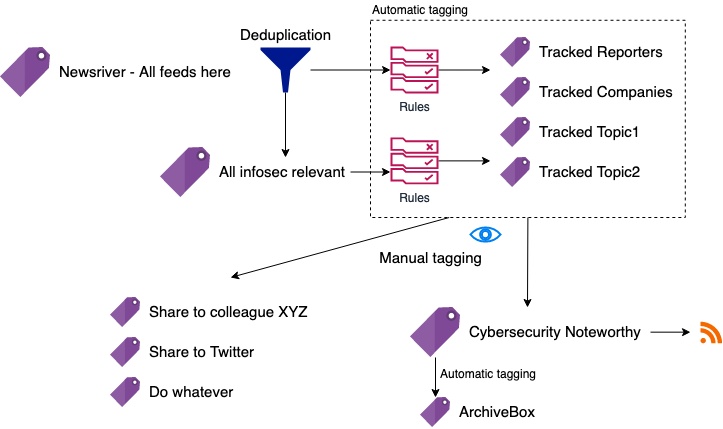

I set Inoreader to first apply global deduplication to the entire newsriver.

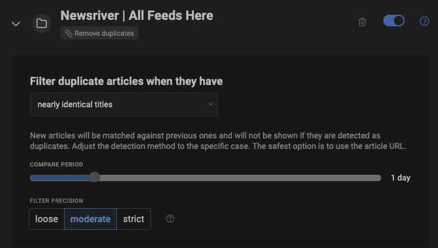

There are indeed cases where the same article would appear multiple times, within the same feed and across distinct feeds.

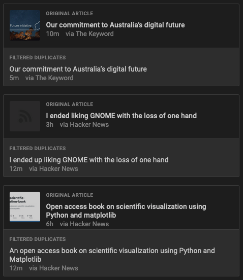

Then, rules are triggered based on my interests in order to tag relevant content according to the following tags (some are omitted for NDA reasons).

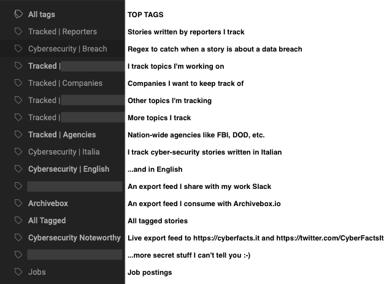

Here you can see some example rules that I created using regular expressions. Inoreader makes it extremely easy to do this.

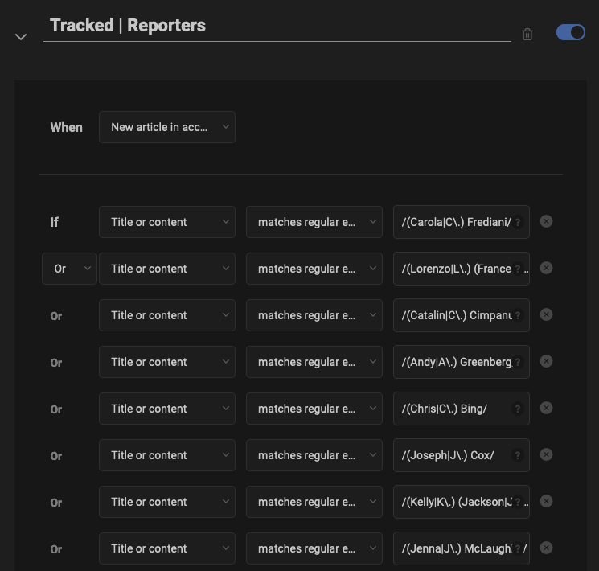

The sources and tags are organized is such that I don't have to think too much about what to read every time I check Inoreader. The top buckets will always appear at the top, and as I mark them as read, they'll disappear from the current bucket, and from any other overlapping buckets below.

When I find an interesting item, I tag it as "Noteworthy," which triggers automatic archival and immediate sharing (e.g., on Twitter). I have private chats with co-workers where I share the same (or slightly different) content. I create one tag for each one of these cases so I can manage their workflows independently.

### Live Sharing With Minimum Friction (3)

I create so-called "export RSS feeds" for the folders and tags which content I want to post-process externally. This includes sharing with colleagues in a private chat, sending to a Telegram channel, publishing on Twitter (which I do, at [CyberFactsIT](https://twitter.com/CyberFactsIT)), or creating a web page like this one at [cyberfacts.it](https://cyberfacts.it). Of course none of this involves any manual action. Instead, it's al handled by Inoreader's RSS export functionality, custom integrations and a GitHub Action to tweet from an RSS feed.

When the content get shared via my social media channels, I receive notifications when people comment, re-share, or like, which gives me an indication of how good my choice was. Also, when I select an item about a completely new (but very important) topic, I setup auto-tagging of that topic, so that I get notified when something about that topic pops in the news again.

### Reading, curation, annotation, summary (4)

Every 1-2 days I go through my "Noteworthy" items and, also based on feedback from social media (if any), I choose the absolutely most important items and read through them in my browser. I have Zotero open all the time, so it only takes me the click of a button in Firefox on the Zotero Connector extension. Each weekly issue lives in a Zotero collection, with sorted sub-collections that mark any subsections I want to create.

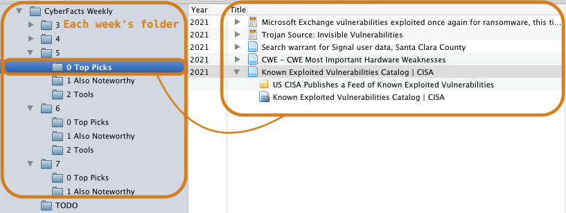

The item is snapshotted in HTML (with embedded elements, so the webpage is fully offline!), a new item is created into Zotero, pre-filled with most of the metadata (e.g., author, URL, date, title).

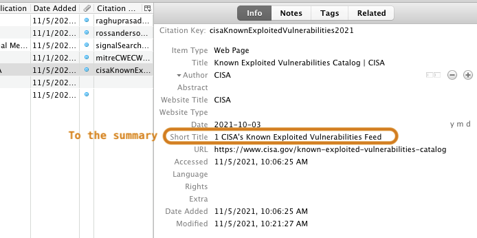

While reading, I copy-paste 2-3 key sentences and add them into a child note of the item I just saved into Zotero. I also and start thinking about a one-liner to summarize the story, which may happen to be the same title chosen by the original reporter.

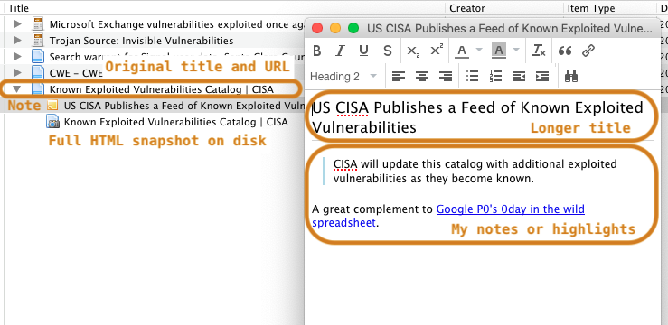

### Weekly digest sharing (5)

Every week, I spend 30' to organize the selected content into 3+ groups: top most important items, also important, tools, and some other ad-hoc groups (e.g., vulnerabilities) as the content demands. I spend most of the 30' actually write an intro to the weekly issue, which goes in the top-level collection as a news item, with a child note holding the actual content.

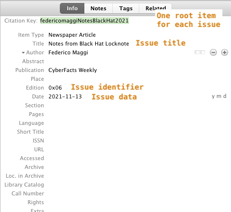

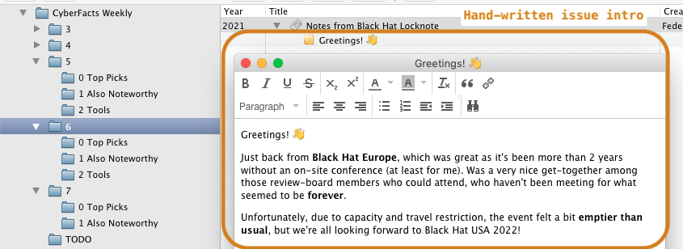

The final step in Zotero is to export to a JSON file.

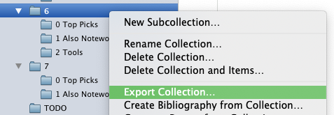

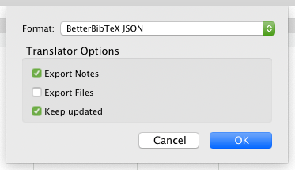

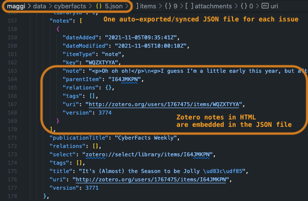

From the weekly JSON file, I have automatic scripts that generate a Markdown file based on a Jinja template, containing an intro, table of content, summary, and list of grouped items.

...

That file is then converted into HTML (via [Hugo](https://gohugo.io)) and summaries for Twitter and LinkedIn.

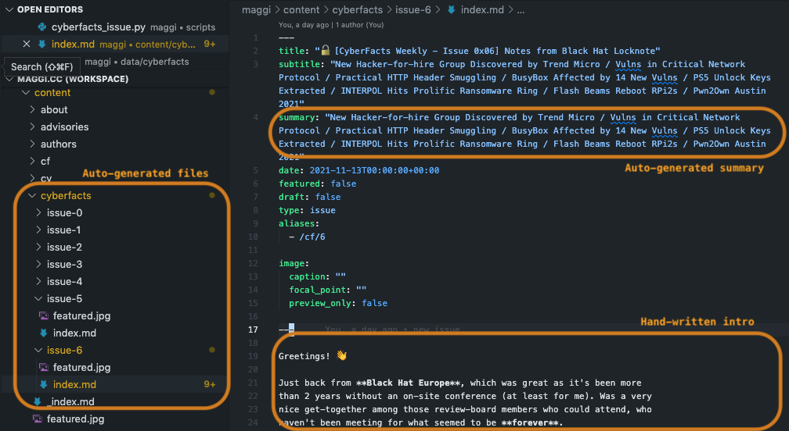

The resulting Markdown file or HTML can be shared to email subscribers via [Buttondown](https://buttondown.email), which is what I do. It has an API, so I guess my next step is to create draft posts automatically, when generating the HTML file.

## What's Left?

It's a huge leap forward if compared to manually maintaining JSON, Markdown, or HTML files. Imagine a simple task like sorting items, or changing a title and update the table of contents, etc.

However, there are a few things that will keep my weekends busy for a couple of hours:

- generate Twitter and LinkedIn post automatically and push draft via their APIs,
- generate a draft and push it to Buttondown via its API,
- trigger Hugo to re-generate the Markdown and HTML file every time the JSON is changed,
- ...and...
- apply some machine-learning magic to automatically find interesting articles according to my selection habits of the past 2 years.

---

That's all folks!

Thanks for reading this far. Hope you learned something new! And if you like to subscribe to my weekly digest or live feed, head over to the [dedicated page](/cyberfacts).
